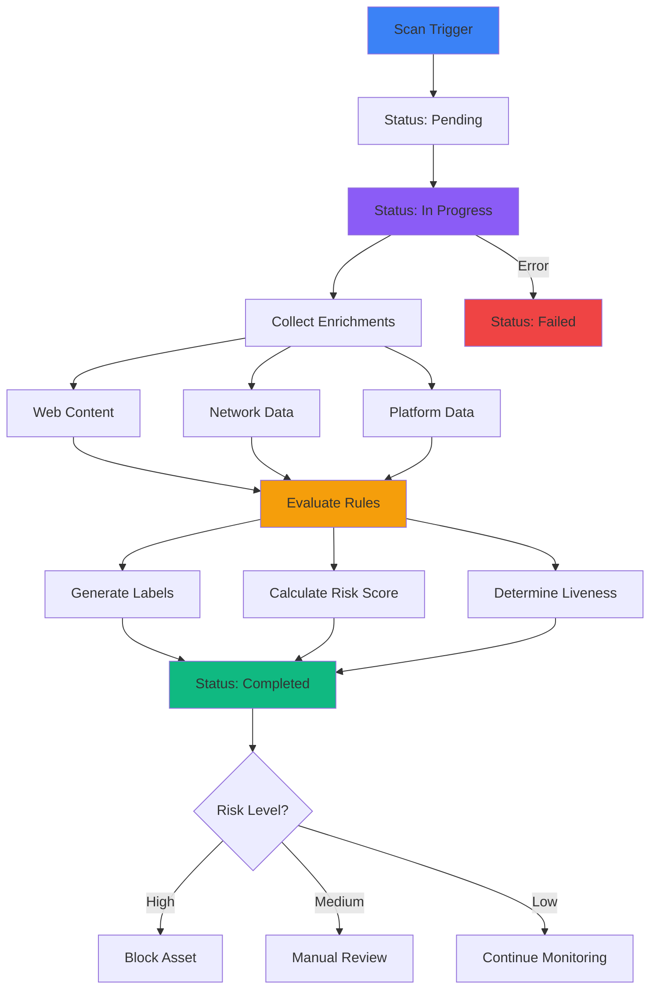

## Definition

<Info>
An **asset scan** is a single security check ChainPatrol performs on an asset (like a URL, social profile, app listing, crypto address, or email) at a specific moment in time.
</Info>

### What It Captures

<CardGroup cols={3}>
  <Card title="What We Saw" icon="eye">
    Visual and content snapshot
  </Card>
  
  <Card title="Extra Context" icon="database">
    Enrichment data collected
  </Card>
  
  <Card title="Risk Conclusion" icon="shield-halved">
    Risk assessment and scores
  </Card>
</CardGroup>

### Why It Matters

Asset scans are the building blocks ChainPatrol uses to:

- Understand threats over time
- Update asset status
- Support reviews and takedowns
- Power reporting and analytics

## Key Characteristics

<Tabs>
  <Tab title="Tied to Specific Asset" icon="link">
    **One scan, one asset**
    
    Every asset scan belongs to exactly one asset and, through that asset, to an organization and optionally a brand.
    
    **Hierarchy:**
    ```
    Organization
      └── Brand (optional)
          └── Asset
              └── Asset Scan
    ```
  </Tab>
  
  <Tab title="Time-Bound Snapshot" icon="clock">
    **Point-in-time record**
    
    Each scan has a timestamp and stands on its own. Later scans might see different:
    - Content
    - Liveness status
    - Risk indicators
    - Infrastructure
    
    <Note>
    This allows ChainPatrol to track how threats evolve over time.
    </Note>
  </Tab>
  
  <Tab title="Status Tracking" icon="list-check">
    **Scan lifecycle states**
    
    A scan has a simple status reflecting where it is in the checking process:
    
    <Steps>
      <Step title="Pending">
        Scan queued but not yet started
      </Step>
      
      <Step title="In Progress">
        Actively collecting data and running checks
      </Step>
      
      <Step title="Completed">
        Scan finished successfully with results
      </Step>
      
      <Step title="Failed">
        Scan encountered errors and couldn't complete
      </Step>
    </Steps>
  </Tab>
  
  <Tab title="Contents" icon="box">
    **What each scan contains**
    
    **Inputs:**
    - What we were asked to scan (URL, address, profile)
    - Related context (organization, brand, detection source)
    
    **Outputs:**
    - Enrichments (extra data we fetched)
    - Labels (risk tags)
    - Liveness status
    - Overall risk score for that point in time
  </Tab>
</Tabs>

## What Lives Inside a Scan

### Enrichments (Extra Context)

Structured information gathered during the scan:

<AccordionGroup>
  <Accordion title="Web Content & Metadata" icon="globe">
    - Page HTML and text content
    - Title, description, keywords
    - Meta tags and structured data
    - Screenshots and visual captures
    - Form fields and input elements
  </Accordion>
  
  <Accordion title="Links Discovered" icon="link">
    - Outbound links from the page
    - Redirect chains
    - External resources loaded
    - Related infrastructure
  </Accordion>
  
  <Accordion title="Technical Details" icon="server">
    - DNS records and resolution
    - TLS/SSL certificate information
    - IP addresses and hosting
    - Server headers and responses
    - Network infrastructure
  </Accordion>
  
  <Accordion title="Platform-Specific Details" icon="share-nodes">
    - Social profile attributes (followers, posts, bio)
    - App store listing information (ratings, reviews, permissions)
    - Blockchain data (contract code, transactions)
    - Email validation results
  </Accordion>
</AccordionGroup>

<Info>
Each enrichment knows where it came from (e.g., "page content", "network", or an external scanner) and whether it succeeded or failed.
</Info>

### Labels (Findings)

Human-readable tags with scores that categorize risk:

<CardGroup cols={3}>
  <Card title="Brand Impersonation" icon="user-secret">
    Visual or textual mimicry of your brand
  </Card>
  
  <Card title="General Phishing" icon="fishing-rod">
    Credential harvesting or scam patterns
  </Card>
  
  <Card title="Provider Blocked" icon="ban">
    Suspended or blocked by hosting provider
  </Card>
  
  <Card title="Wallet Drainer" icon="wallet">
    Malicious wallet connection code
  </Card>
  
  <Card title="Parked Domain" icon="parking">
    Domain reserved but not in use
  </Card>
  
  <Card title="Typosquatting" icon="keyboard">
    Domain closely resembling legitimate one
  </Card>
</CardGroup>

<Note>
These labels are used to group risk into categories like **general phishing**, **brand impersonation**, or **wallet-related risk**.
</Note>

### Scores and Liveness

A scan tracks two key metrics:

<Tabs>
  <Tab title="Risk Score" icon="gauge">
    **Combined risk assessment**
    
    A numerical score (typically 0-1) representing the overall risk level at that point in time.
    
    **Calculated from:**
    - Label scores
    - Rule evaluations
    - Confidence levels
    - Historical patterns
  </Tab>
  
  <Tab title="Liveness Status" icon="heartbeat">
    **Asset accessibility**
    
    Indicates whether the asset is currently accessible:
    
    <CardGroup cols={3}>
      <Card title="ALIVE" icon="circle-check" color="#10b981">
        Asset is accessible and active
      </Card>
      
      <Card title="DEAD" icon="circle-xmark" color="#ef4444">
        Asset is inaccessible or removed
      </Card>
      
      <Card title="UNKNOWN" icon="circle-question" color="#f59e0b">
        Status cannot be determined
      </Card>
    </CardGroup>
    
    **Reasons tracked:**
    - DNS failed
    - Parked domain detected
    - Suspended by provider
    - 404 not found
    - Connection timeout
  </Tab>
</Tabs>

## How Asset Scans Relate to Other Concepts

<AccordionGroup>
  <Accordion title="Asset" icon="link">
    **The foundation**
    
    The asset is the "thing" (URL, profile, listing, address); scans are the history of what we have seen about that thing.
    
    **Relationship:**
    - One asset → Many scans over time
    - Scans build a timeline of the asset's behavior
    - Most recent scan typically used for current status
  </Accordion>
  
  <Accordion title="Threats / Detections" icon="radar">
    **Input for threat identification**
    
    Threat records (detections) use scan labels and scores as key inputs to decide whether something should be treated as an active threat for your organization.
    
    **How they connect:**
    - Detection triggers → Asset scan
    - Scan results → Threat score
    - Threat score → Detection confidence
  </Accordion>
  
  <Accordion title="Reviews" icon="clipboard-check">
    **Evidence for decision-making**
    
    When your team reviews a reported asset, they see the most relevant scan results to understand why it was flagged and whether it should be allowed, blocked, or escalated.
    
    **What reviewers see:**
    - Screenshots from scans
    - Labels and scores
    - Enrichment data
    - Historical scan timeline
  </Accordion>
  
  <Accordion title="Blocklist, Allowlist, Watchlist" icon="list">
    **Status determination**
    
    Repeated scan results help decide:
    
    - **Blocked** - Assets that consistently look malicious
    - **Allowed** - Assets that can be treated as safe
    - **Watchlisted** - Assets that are sensitive or change frequently
    
    **Decision factors:**
    - Consistent risk scores across scans
    - Liveness changes over time
    - Pattern stability
  </Accordion>
  
  <Accordion title="Takedowns" icon="power-off">
    **Evidence for removal**
    
    For assets that need to be taken down, scan data provides evidence to support outreach to hosting providers, registrars, and platforms.
    
    **What's provided:**
    - Screenshots showing malicious content
    - Metadata and technical details
    - Liveness history
    - Timeline of activity
  </Accordion>
  
  <Accordion title="Relationships Between Assets" icon="network-wired">
    **Campaign mapping**
    
    When scans find links and redirects, they can be connected together to show clusters of related pages or infrastructure.
    
    **Benefits:**
    - Identify broader campaigns
    - Map attacker infrastructure
    - Understand threat networks
    - Coordinate takedowns
  </Accordion>
</AccordionGroup>

## Examples

<Tabs>
  <Tab title="Example 1: Suspicious Login Page" icon="lock">
    **Scenario:**
    A new login page is found in search results.
    
    **Scan Process:**
    1. ChainPatrol scans the page
    2. Sees it closely imitates your brand
    3. Detects wallet connection requests
    4. Assigns strong phishing and brand-impersonation labels
    
    **Result:**
    - Scan feeds into a threat record for your organization
    - Appears in your triage queue
    - High-priority review recommended
    
    <Warning>
    High-confidence scans like this often trigger automatic blocking.
    </Warning>
  </Tab>
  
  <Tab title="Example 2: Official Site Staying Healthy" icon="circle-check">
    **Scenario:**
    Your official website is added as an asset and monitored.
    
    **Scan Process:**
    1. Regular scans performed (daily or weekly)
    2. Shows asset is alive and consistent
    3. Does not trigger risky labels
    4. Maintains stable risk score near zero
    
    **Result:**
    - Remains allowed
    - Serves as a "known good" reference
    - Used for comparison against suspicious assets
    
    <Check>
    Regular scanning of official assets helps establish baselines for comparison.
    </Check>
  </Tab>
  
  <Tab title="Example 3: Impersonating Social Profile" icon="user-secret">
    **Scenario:**
    A social profile claiming to be one of your employees is discovered.
    
    **Scan Process:**
    1. Profile scanned for attributes
    2. Shows overlapping branding
    3. Detects suspicious outreach behavior
    4. Increases impersonation scores
    
    **Result:**
    - Scan supports team decision-making
    - Evidence for escalation
    - Basis for pursuing takedown
    - Documented proof of impersonation
    
    <Info>
    Social profile scans capture bio, images, posts, and engagement patterns.
    </Info>
  </Tab>
</Tabs>

## What Asset Scans Are Not

<CardGroup cols={3}>
  <Card title="Not a Human Report" icon="user-xmark">
    Asset scans are system-generated. **Reports** are created by users or external systems raising issues.
  </Card>
  
  <Card title="Not a Case" icon="folder-xmark">
    A scan can be clean or suspicious. A threat or incident record is created only when risk crosses thresholds or a human escalates it.
  </Card>
  
  <Card title="Not a Configuration" icon="gear-xmark">
    Scans use your **rules**, **thresholds**, and **service settings**, but they are not where you configure behavior—they are the evidence those settings produce.
  </Card>
</CardGroup>

## Scan Workflow



## Key Takeaways

<CardGroup cols={2}>
  <Card title="Point-in-Time Snapshot" icon="camera">
    Each scan captures asset state at a specific moment
  </Card>
  
  <Card title="Building Blocks" icon="cubes">
    Scans are fundamental to threat understanding
  </Card>
  
  <Card title="Rich Context" icon="database">
    Enrichments provide comprehensive asset intelligence
  </Card>
  
  <Card title="Risk Labels" icon="tags">
    Human-readable categorization of threats
  </Card>
  
  <Card title="Timeline History" icon="timeline">
    Multiple scans show asset evolution over time
  </Card>
  
  <Card title="Evidence Base" icon="file-lines">
    Provides proof for reviews and takedowns
  </Card>
  
  <Card title="Relationship Mapping" icon="network-wired">
    Links between assets reveal campaigns
  </Card>
  
  <Card title="Automated & Systematic" icon="robot">
    Consistent, repeatable security checks
  </Card>
</CardGroup>

---

<Card
  title="View Asset Scan History"
  icon="magnifying-glass-chart"
  href="https://app.chainpatrol.io"
>
  Access your dashboard to review asset scans and their results
</Card>
