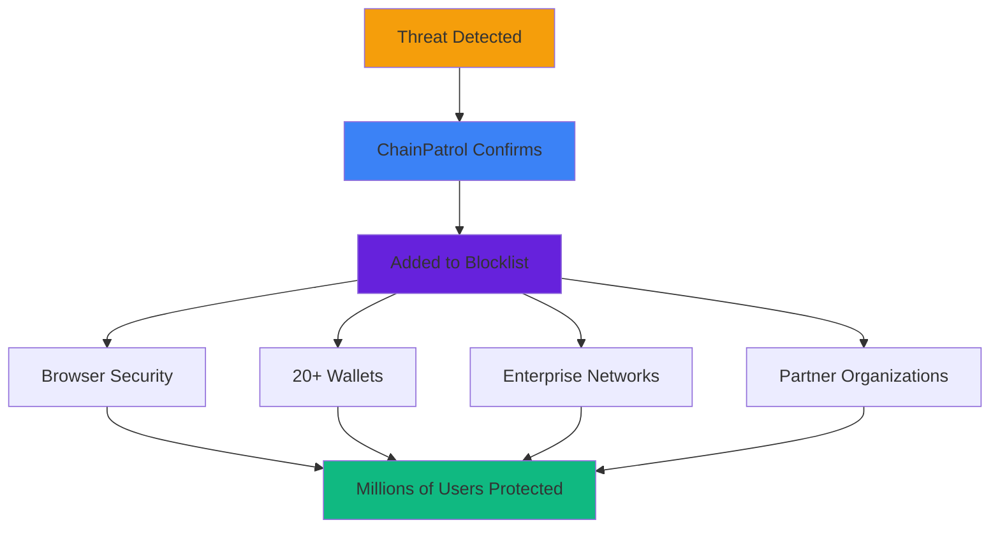

## What is a Blocklist?

A blocklist (also known as a denylist) is a database of confirmed malicious entities that should be blocked or flagged to protect users. In the context of web3 security, a blocklist contains verified phishing websites, scam social media accounts, fraudulent crypto addresses, and other malicious assets that pose a threat to users.

<Info>
ChainPatrol's blocklist functions as a **threat intelligence database** that's continuously updated and distributed in real-time.
</Info>

### Real-Time Protection

Unlike traditional security databases that may update daily or weekly, our blocklist provides immediate updates as threats are confirmed, ensuring protection is deployed within **15-30 minutes** rather than hours or days.

<Check>
The blocklist serves as the foundation of proactive security—instead of waiting for users to encounter threats, we identify, verify, and distribute threat intelligence to prevent exposure before it happens.
</Check>

## Why Do We Use a Blocklist and Why Is It Effective?

### The Problem with Traditional Takedowns

Traditional cybersecurity approaches rely heavily on **takedowns**—requesting hosting providers or domain registrars to remove malicious content. However, this approach has critical limitations:

<CardGroup cols={2}>
  <Card title="Slow Response Times" icon="clock">
    4-48 hours for hosting providers, 24-72 hours for domain takedowns
  </Card>
  
  <Card title="Incomplete Coverage" icon="circle-xmark">
    Some providers never respond or operate in non-cooperative jurisdictions
  </Card>
  
  <Card title="Attack Window" icon="stopwatch">
    Scammers can steal funds within minutes of launching a phishing site
  </Card>
  
  <Card title="Whack-a-Mole" icon="hammer">
    Attackers quickly spin up new domains or move to different providers
  </Card>
</CardGroup>

### The Blocklist Advantage

ChainPatrol's blocklist provides **immediate protection** through a "blocklist-first, takedown-second" approach:

<Steps>
  <Step title="Speed">
    Assets are blocklisted and distributed in **15-30 minutes** after confirmation
  </Step>
  
  <Step title="Universal Coverage">
    Protection works regardless of hosting provider, jurisdiction, or whether the malicious content remains online
  </Step>
  
  <Step title="Point-of-Access Protection">
    Blocks are enforced at the browser, wallet, and network level—where users actually interact with threats
  </Step>
  
  <Step title="Persistent Protection">
    Even if a scammer sets up 100 copycat sites, each one gets blocklisted as soon as it's detected
  </Step>
</Steps>

<Warning>
In web3, where transactions are irreversible and scams can drain wallets in seconds, **prevention at the point of interaction is critical**.
</Warning>

### Network Effects

The effectiveness of our blocklist increases exponentially with distribution:

<Check>
**One confirmation protects millions of users** across the entire web3 ecosystem.
</Check>

## Who Contributes to the Blocklist?

ChainPatrol's blocklist is powered by a diverse network of contributors:

<Tabs>
  <Tab title="Community Reports" icon="users">
    **Grassroots threat intelligence**
    
    <AccordionGroup>
      <Accordion title="End Users" icon="user">
        Anyone can report suspicious assets through our public reporting interface
      </Accordion>
      
      <Accordion title="Web3 Communities" icon="comments">
        Discord moderators, Twitter users, and Reddit communities actively report scams targeting their communities
      </Accordion>
      
      <Accordion title="Victims" icon="triangle-exclamation">
        Users who've encountered or fallen victim to scams help us identify active threats
      </Accordion>
    </AccordionGroup>
  </Tab>
  
  <Tab title="Partner Organizations" icon="handshake">
    **Collaborative threat sharing**
    
    <CardGroup cols={2}>
      <Card title="100+ Organizations" icon="building">
        Companies using ChainPatrol for brand protection contribute threat intelligence
      </Card>
      
      <Card title="Wallet Providers" icon="wallet">
        MetaMask, Phantom, Coinbase Wallet, and others share detected threats
      </Card>
      
      <Card title="Security Alliances" icon="shield">
        SEAL-ISAC, Crypto-ISAC, and other information sharing networks
      </Card>
      
      <Card title="Blockchain Projects" icon="link">
        Web3 protocols and DAOs monitoring for impersonation attacks
      </Card>
    </CardGroup>
  </Tab>
  
  <Tab title="Automated Detection" icon="robot">
    **AI-powered threat discovery**
    
    <CardGroup cols={2}>
      <Card title="AI-Powered Scanning" icon="brain">
        Detection engine continuously monitors using 50+ detection rules
      </Card>
      
      <Card title="Certificate Transparency" icon="certificate">
        Real-time monitoring of newly registered domains
      </Card>
      
      <Card title="Social Media Monitoring" icon="share-nodes">
        Automated detection of impersonation accounts and scam posts
      </Card>
      
      <Card title="Honeypots" icon="bug">
        Intentional traps that identify and track attacker infrastructure
      </Card>
    </CardGroup>
  </Tab>
  
  <Tab title="Expert Review Team" icon="user-shield">
    **Human verification layer**
    
    While many sources contribute **detections**, all blocklist entries are verified by ChainPatrol's security team before being added.
    
    **Why this matters:**
    - Ensures accuracy
    - Minimizes false positives
    - Maintains blocklist quality
    - Provides human judgment for edge cases
    
    <Note>
    This human-in-the-loop review process is critical for maintaining trust in the blocklist.
    </Note>
  </Tab>
</Tabs>

## What Is In Scope for Being Added to the Blocklist?

Assets are added to the blocklist when they meet two criteria: **intent** and **confirmation**.

### Intent: Malicious Purpose

Assets must demonstrate clear malicious intent:

<CardGroup cols={2}>
  <Card title="Phishing" icon="fishing-rod">
    Sites designed to steal credentials, seed phrases, or private keys
  </Card>
  
  <Card title="Scams" icon="sack-dollar">
    Fraudulent schemes (fake airdrops, rug pulls, Ponzi schemes)
  </Card>
  
  <Card title="Impersonation" icon="user-secret">
    Content falsely claiming to represent legitimate brands
  </Card>
  
  <Card title="Malware Distribution" icon="virus">
    Sites or links that distribute malicious software
  </Card>
  
  <Card title="Social Engineering" icon="brain">
    Content designed to manipulate users into compromising security
  </Card>
</CardGroup>

### Confirmation: Evidence-Based Verification

Assets must be confirmed as malicious through:

<Steps>
  <Step title="Multiple Credible Reports">
    Independent sources reporting the same threat
  </Step>
  
  <Step title="Evidence of Attacks">
    Proof of successful attacks or victim reports
  </Step>
  
  <Step title="Technical Analysis">
    Malicious code or behavior detected
  </Step>
  
  <Step title="Pattern Matching">
    Clear alignment with known attack techniques
  </Step>
  
  <Step title="Brand Owner Confirmation">
    Verification of unauthorized use (when applicable)
  </Step>
</Steps>

### Out of Scope

The following are **not** added to the blocklist:

<AccordionGroup>
  <Accordion title="Legitimate Criticism" icon="comment">
    Negative reviews, critical commentary, or parody (protected speech)
  </Accordion>
  
  <Accordion title="Competitor Content" icon="building">
    Content from legitimate competitors, even if unfavorable
  </Accordion>
  
  <Accordion title="Alleged Scams" icon="question">
    Projects accused of being scams without concrete evidence of malicious activity
  </Accordion>
  
  <Accordion title="Civil Disputes" icon="gavel">
    Trademark disputes, contract disagreements, or business conflicts (handle through legal channels)
  </Accordion>
  
  <Accordion title="Low-Confidence Detections" icon="gauge-low">
    Suspicious but unconfirmed assets (may be monitored, but not blocklisted)
  </Accordion>
</AccordionGroup>

<Info>
This scope ensures our blocklist maintains high accuracy and focuses on clear, immediate threats to user security.
</Info>

## What Type of Data Is In Our Blocklist?

ChainPatrol's blocklist includes multiple asset types, each with specific attributes:

<Tabs>
  <Tab title="URLs and Domains" icon="globe">
    **Web-based threats**
    
    - **Full URLs**: Specific phishing pages (e.g., `https://metamask-security-verify.com/connect`)
    - **Domains**: Root domains and subdomains (e.g., `phishing-site.com`, `scam.evil-host.net`)
    - **Status**: Current blocklist status and distribution state
    - **First Seen**: When the asset was first detected or reported
    - **Blocklist Date**: When it was added to the blocklist
    - **Associated Data**: Screenshots, detection rules triggered, related assets
  </Tab>
  
  <Tab title="Social Media Accounts" icon="share-nodes">
    **Platform impersonation**
    
    <AccordionGroup>
      <Accordion title="Twitter/X Accounts" icon="x-twitter">
        Impersonation and scam accounts
      </Accordion>
      
      <Accordion title="Telegram Groups/Channels" icon="telegram">
        Fake support channels and scam groups
      </Accordion>
      
      <Accordion title="Discord Servers" icon="discord">
        Phishing servers and fake community servers
      </Accordion>
      
      <Accordion title="YouTube Channels" icon="youtube">
        Scam livestreams and fake giveaways
      </Accordion>
      
      <Accordion title="Facebook Pages/Groups" icon="facebook">
        Impersonation pages and scam groups
      </Accordion>
    </AccordionGroup>
    
    **Platform-Specific Identifiers**: Account handles, user IDs, channel links
  </Tab>
  
  <Tab title="Blockchain Addresses" icon="link">
    **On-chain threats**
    
    - **Ethereum Addresses**: Scam contracts, phishing wallets, rug pull contracts
    - **Multi-Chain Support**: Addresses across multiple blockchain networks
    - **Contract Metadata**: Contract code analysis, transaction patterns
    - **Labels**: Scam type (fake airdrop, phishing, Ponzi scheme)
  </Tab>
  
  <Tab title="Email Addresses" icon="envelope">
    **Email-based threats**
    
    - **Phishing Emails**: Addresses used in phishing campaigns
    - **Scam Support**: Fake customer support email addresses
    - **Associated Domains**: Email domains linked to scam operations
  </Tab>
  
  <Tab title="Other Digital Assets" icon="folder">
    **Additional threat vectors**
    
    <CardGroup cols={2}>
      <Card title="Mobile Apps" icon="mobile">
        Fake wallet apps, scam applications
      </Card>
      
      <Card title="Browser Extensions" icon="puzzle-piece">
        Malicious extensions that steal credentials
      </Card>
      
      <Card title="IPFS Hashes" icon="database">
        Decentralized content hosting phishing pages
      </Card>
      
      <Card title="NFT Collections" icon="image">
        Scam NFT projects and counterfeit collections
      </Card>
    </CardGroup>
  </Tab>
</Tabs>

### Metadata for All Assets

Every blocklisted asset includes comprehensive metadata:

<CardGroup cols={3}>
  <Card title="Asset Type" icon="tag">
    Category of the malicious asset
  </Card>
  
  <Card title="Status" icon="traffic-light">
    Current state (BLOCKED, ALLOWED, PENDING)
  </Card>
  
  <Card title="Severity" icon="gauge">
    Risk level assessment
  </Card>
  
  <Card title="Related Assets" icon="network-wired">
    Connected infrastructure (same scam campaign)
  </Card>
  
  <Card title="Detection Methods" icon="magnifying-glass">
    Which rules or sources identified the threat
  </Card>
  
  <Card title="Distribution Status" icon="share">
    Which partners have received the update
  </Card>
  
  <Card title="Update History" icon="clock-rotate-left">
    Timeline of status changes and reviews
  </Card>
</CardGroup>

## Who Uses Our Blocklist?

ChainPatrol's blocklist protects users across the web3 ecosystem through multiple integration types:

<Tabs>
  <Tab title="Browser Security" icon="browser">
    **Universal web protection**
    
    <CardGroup cols={2}>
      <Card title="Google Safe Browsing" icon="chrome">
        Powers protection in Chrome, Safari, Edge, Firefox, and other browsers
      </Card>
      
      <Card title="Cloudflare Gateway" icon="cloud">
        Network-level protection for enterprises and organizations
      </Card>
      
      <Card title="Direct Integrations" icon="plug">
        Custom integrations for web3-focused browsers
      </Card>
    </CardGroup>
    
    **Impact**: Blocklisted URLs are prevented from loading or show warning pages, protecting users regardless of which website they're visiting.
  </Tab>
  
  <Tab title="Wallet Providers" icon="wallet">
    **Transaction-level protection**
    
    <AccordionGroup>
      <Accordion title="MetaMask" icon="fox">
        Direct integration via Eth-Phishing-Detect
      </Accordion>
      
      <Accordion title="Phantom" icon="ghost">
        Real-time API integration
      </Accordion>
      
      <Accordion title="Coinbase Wallet" icon="coinbase">
        Via multiple blocklist sources
      </Accordion>
      
      <Accordion title="Trust Wallet" icon="shield">
        Integration through WalletConnect and other channels
      </Accordion>
      
      <Accordion title="Rainbow, Ledger, WalletConnect" icon="wallet">
        Real-time API protection
      </Accordion>
      
      <Accordion title="15+ Additional Wallets" icon="layer-group">
        Various integration methods
      </Accordion>
    </AccordionGroup>
    
    **Impact**: Wallets warn users before connecting to malicious sites or interacting with scam contracts, preventing fund loss at the point of transaction.
  </Tab>
  
  <Tab title="Web3 Applications" icon="cube">
    **Platform-specific protection**
    
    <CardGroup cols={2}>
      <Card title="Polymarket" icon="chart-line">
        Content moderation and user protection
      </Card>
      
      <Card title="Snapshot" icon="camera">
        Governance platform security
      </Card>
      
      <Card title="NFT Marketplaces" icon="image">
        Filtering scam collections and malicious listings
      </Card>
      
      <Card title="DeFi Protocols" icon="coins">
        Protecting users from fake interfaces and phishing sites
      </Card>
    </CardGroup>
    
    **Impact**: Applications can automatically filter malicious content and warn users about threats specific to their platform.
  </Tab>
  
  <Tab title="Threat Intelligence" icon="shield-halved">
    **Ecosystem-wide sharing**
    
    <CardGroup cols={2}>
      <Card title="SEAL-ISAC" icon="users">
        Security Alliance's information sharing network (600+ members)
      </Card>
      
      <Card title="Crypto-ISAC" icon="bitcoin">
        Cryptocurrency industry threat intelligence
      </Card>
      
      <Card title="Eth-Phishing-Detect" icon="ethereum">
        Ethereum ecosystem blocklist (ChainPatrol is a core contributor)
      </Card>
      
      <Card title="Polkadot Phishing List" icon="link">
        Cross-chain threat sharing
      </Card>
    </CardGroup>
    
    **Impact**: Our blocklist feeds into the broader security ecosystem, creating a network effect where threats are shared across organizations and platforms.
  </Tab>
  
  <Tab title="Enterprise Security" icon="building">
    **Organizational protection**
    
    <CardGroup cols={3}>
      <Card title="Security Teams" icon="shield">
        Protect employees and users
      </Card>
      
      <Card title="Brand Protection" icon="trademark">
        Monitor and block impersonation attempts
      </Card>
      
      <Card title="Custom Integrations" icon="code">
        API access for internal security tools and workflows
      </Card>
    </CardGroup>
    
    **Impact**: Organizations can integrate ChainPatrol's threat intelligence into their existing security infrastructure for comprehensive protection.
  </Tab>
  
  <Tab title="Public Access" icon="globe">
    **Open threat intelligence**
    
    <CardGroup cols={3}>
      <Card title="Public API" icon="code">
        Freely accessible blocklist API for developers and security researchers
      </Card>
      
      <Card title="SDK" icon="box">
        Developer tools for easy integration
      </Card>
      
      <Card title="Web Dashboard" icon="browser">
        Search and lookup interface for manual checks
      </Card>
    </CardGroup>
    
    **Impact**: Anyone can access our blocklist data to build security tools, perform research, or check suspicious assets.
  </Tab>
</Tabs>

---

## Key Takeaways

<CardGroup cols={2}>
  <Card title="Real-Time Protection" icon="bolt">
    15-30 minute response time vs. hours or days for takedowns
  </Card>
  
  <Card title="Universal Coverage" icon="globe">
    Works regardless of hosting provider or jurisdiction
  </Card>
  
  <Card title="Network Effects" icon="network-wired">
    One confirmation protects millions of users
  </Card>
  
  <Card title="Diverse Contributors" icon="users">
    Community, partners, automation, and expert review
  </Card>
  
  <Card title="Evidence-Based" icon="magnifying-glass">
    Requires both malicious intent and confirmation
  </Card>
  
  <Card title="Multi-Asset Support" icon="layer-group">
    URLs, social accounts, blockchain addresses, and more
  </Card>
  
  <Card title="Broad Distribution" icon="share">
    Browsers, wallets, applications, and enterprises
  </Card>
  
  <Card title="Publicly Accessible" icon="unlock">
    Open API and SDK for developers and researchers
  </Card>
</CardGroup>

---

<Card
  title="Access the Blocklist"
  icon="list"
  href="https://app.chainpatrol.io"
>
  View blocklisted assets and check suspicious content in your dashboard
</Card>
