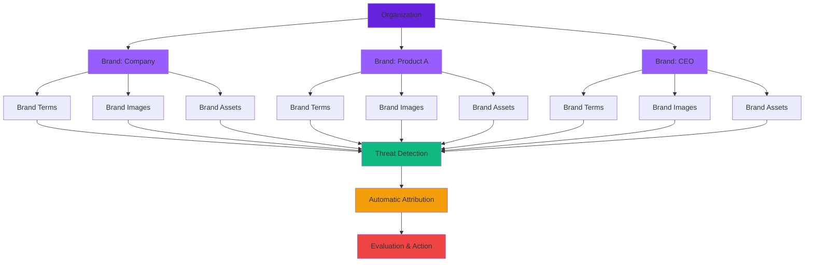

## What Is a Brand in ChainPatrol?

A **brand** represents an identity that ChainPatrol protects.

<Info>
Brands belong to an **organization**, and a single organization can have **multiple brands**.
</Info>

## Types of Brands

ChainPatrol supports two types of brands:

<Tabs>
  <Tab title="Company Brands" icon="building">
    **What they represent:**
    
    These represent the organization itself or its products.
    
    **Examples:**
    - "ChainPatrol" (primary brand)
    - Product lines or services
    - Sub-brands created for specific business units
    - Regional or market-specific brands
    
    <Card title="Use Case" icon="lightbulb">
      A Web3 company protecting their main protocol name, their governance token, and their NFT marketplace brand
    </Card>
  </Tab>
  
  <Tab title="Individual Brands" icon="user">
    **What they represent:**
    
    These represent key people associated with the organization.
    
    **Examples:**
    - CEO
    - Executives
    - Public-facing employees
    - Founders
    - Brand ambassadors
    
    <Card title="Use Case" icon="lightbulb">
      Protecting a CEO who is frequently impersonated on Twitter/X and Telegram by scammers offering fake investment opportunities
    </Card>
  </Tab>
</Tabs>

<Check>
Both company and individual brands can be targeted by impersonation, scams, or fraud, and ChainPatrol protects both.
</Check>

## What Information Is Stored in a Brand?

Each brand includes several components that help ChainPatrol understand what legitimate content looks like and identify potential threats.

<CardGroup cols={3}>
  <Card title="Brand Terms" icon="text">
    Keywords and variations
  </Card>
  
  <Card title="Brand Images" icon="image">
    Logos and visual elements
  </Card>
  
  <Card title="Brand Assets" icon="link">
    Official properties
  </Card>
</CardGroup>

### Brand Terms

<Accordion title="What are Brand Terms?" icon="text" defaultOpen>
  Brand terms are **keywords associated with a brand** that describe how the brand is commonly referenced online.
  
  **They include:**
  - Official brand names
  - Variations and abbreviations
  - Product names
  - Nicknames or widely used informal names
  - Individual names (for personal brands)
  
  **Examples for "ChainPatrol":**
  - ChainPatrol
  - Chain Patrol
  - CP
  - @chainpatrol
  - chainpatrol.io
</Accordion>

<Info>
By defining brand terms, ChainPatrol is able to recognize when content is likely related to a specific brand and assess whether that content may be legitimate or potentially impersonating the brand.
</Info>

### Brand Images

<Accordion title="What are Brand Images?" icon="image" defaultOpen>
  Brand images include visual elements that represent the brand.
  
  **They include:**
  - Logos (all variations)
  - Official graphics and design elements
  - Profile photos for individuals
  - Brand marks and symbols
  - Visual identity assets
  
  **How they're used:**
  
  These images are used during detection to help identify potential impersonation, for example by matching logos or profile photos against suspicious content that may be attempting to mimic the brand.
</Accordion>

### Brand Assets

<Accordion title="What are Brand Assets?" icon="link" defaultOpen>
  Brand assets represent **known, legitimate assets owned by the brand**.
  
  These are used to distinguish between real content and potentially harmful impersonation.
  
  **A brand asset can be any asset type supported by ChainPatrol:**
  
  <CardGroup cols={3}>
    <Card title="Websites" icon="globe">
      Official websites and domains
    </Card>
    
    <Card title="Social Media" icon="share-nodes">
      Twitter, Discord, Telegram profiles
    </Card>
    
    <Card title="App Listings" icon="mobile">
      App store and extension listings
    </Card>
    
    <Card title="Repositories" icon="github">
      GitHub and code repositories
    </Card>
    
    <Card title="Channels" icon="telegram">
      Telegram channels and groups
    </Card>
    
    <Card title="Other Properties" icon="link">
      Any verified online property
    </Card>
  </CardGroup>
</Accordion>

<Note>
Brand assets serve as a **whitelist** of what is considered authentic.
</Note>

## How Brand Information Is Used

ChainPatrol combines **brand terms**, **brand images**, and **brand assets** to understand a brand's identity and accurately assign threats to the correct brand.

### The Attribution Process

<Steps>
  <Step title="Threat Detection">
    Suspicious content is detected across the internet
  </Step>
  
  <Step title="Brand Matching">
    ChainPatrol analyzes the content for:
    - Brand terms (name, keywords)
    - Brand images (logos, visuals)
    - Similarity to brand assets (mimicking official properties)
  </Step>
  
  <Step title="Automatic Attribution">
    The threat is automatically associated with the relevant brand
  </Step>
  
  <Step title="Evaluation & Action">
    The threat is properly evaluated and acted upon in the context of that brand
  </Step>
</Steps>

<Info>
This attribution process happens automatically and at a high level, allowing threats to be categorized without requiring manual intervention in most cases.
</Info>

### Example Attribution

<Tabs>
  <Tab title="Scenario 1: Domain Impersonation" icon="globe">
    **Detected Threat:**
    - Domain: `chainpatr0l-airdrop.com`
    - Uses ChainPatrol logo
    - Mimics official website design
    
    **Attribution:**
    - Matches brand term: "chainpatrol" (with typo)
    - Matches brand image: Official logo detected
    - Mimics brand asset: Official website structure
    
    **Result:** Automatically attributed to "ChainPatrol" brand
  </Tab>
  
  <Tab title="Scenario 2: Social Media Impersonation" icon="x-twitter">
    **Detected Threat:**
    - Twitter account: `@chainpatrol_support`
    - Profile photo: ChainPatrol logo
    - Bio mentions: "Official ChainPatrol Support"
    
    **Attribution:**
    - Matches brand term: "chainpatrol"
    - Matches brand image: Logo in profile photo
    - Impersonates brand asset: Claims to be official support
    
    **Result:** Automatically attributed to "ChainPatrol" brand
  </Tab>
  
  <Tab title="Scenario 3: Executive Impersonation" icon="user">
    **Detected Threat:**
    - Telegram account: Claims to be CEO
    - Profile photo: CEO's headshot
    - Messages: Offering investment opportunities
    
    **Attribution:**
    - Matches brand term: CEO's name
    - Matches brand image: CEO's photo
    - Impersonates individual brand
    
    **Result:** Automatically attributed to CEO's individual brand
  </Tab>
</Tabs>

### Benefits of Accurate Attribution

<CardGroup cols={2}>
  <Card title="Clear Visibility" icon="eye">
    Organizations have clear visibility into which brands are being impersonated
  </Card>
  
  <Card title="Frequency Tracking" icon="chart-line">
    Understand how frequently each brand is targeted
  </Card>
  
  <Card title="Action Association" icon="link">
    See which takedowns or mitigation actions are associated with each brand
  </Card>
  
  <Card title="Trend Analysis" icon="chart-bar">
    Identify patterns and emerging threats per brand
  </Card>
</CardGroup>

## Brands and Organizations

A single organization may be responsible for managing and protecting multiple brands.

### Common Multi-Brand Scenarios

<AccordionGroup>
  <Accordion title="Corporate + Product Brands" icon="building">
    A company safeguarding both its corporate identity and several product lines.
    
    **Example:**
    - Main brand: "Acme Protocol"
    - Product brand: "Acme Swap"
    - Product brand: "Acme Wallet"
    - Product brand: "Acme DAO"
  </Accordion>
  
  <Accordion title="Executive Protection" icon="user-tie">
    Protecting individual executives or other public-facing staff members.
    
    **Example:**
    - Main brand: "Acme Protocol"
    - Individual brand: "Jane Smith (CEO)"
    - Individual brand: "John Doe (CTO)"
    - Individual brand: "Sarah Johnson (CMO)"
  </Accordion>
  
  <Accordion title="Regional or Market Brands" icon="globe">
    Maintaining distinct brands used across different markets, languages, or regions.
    
    **Example:**
    - Main brand: "Acme Protocol"
    - Regional brand: "Acme Asia"
    - Regional brand: "Acme Europe"
    - Regional brand: "Acme LATAM"
  </Accordion>
  
  <Accordion title="Acquired Companies" icon="handshake">
    Managing brands from acquired companies while maintaining their separate identities.
    
    **Example:**
    - Parent brand: "Acme Holdings"
    - Acquired brand: "Beta Protocol"
    - Acquired brand: "Gamma Finance"
  </Accordion>
</AccordionGroup>

<Check>
ChainPatrol keeps brand information structured and separate to ensure that each brand can be protected individually while still remaining clearly associated with the same organization.
</Check>

### Organizational Benefits

<Tabs>
  <Tab title="Granular Control" icon="sliders">
    **Brand-Level Management**
    
    - Configure protection settings per brand
    - Track metrics for each brand independently
    - Assign different team members to different brands
    - Customize detection rules by brand
  </Tab>
  
  <Tab title="Unified View" icon="chart-network">
    **Organization-Level Oversight**
    
    - See all brands in one dashboard
    - Compare threat volumes across brands
    - Aggregate metrics for reporting
    - Maintain consistent policies across brands
  </Tab>
  
  <Tab title="Flexible Structure" icon="sitemap">
    **Scalable Architecture**
    
    - Add new brands as you grow
    - Reorganize brands as needed
    - Merge or split brands
    - Maintain historical data
  </Tab>
</Tabs>

---

## Brand Protection Workflow

---

## Key Takeaways

<CardGroup cols={2}>
  <Card title="Identity Protection" icon="shield">
    Brands represent identities that need protection
  </Card>
  
  <Card title="Two Types" icon="users">
    Company brands and individual brands
  </Card>
  
  <Card title="Three Components" icon="layer-group">
    Terms, images, and assets define each brand
  </Card>
  
  <Card title="Automatic Attribution" icon="robot">
    Threats are automatically assigned to brands
  </Card>
  
  <Card title="Multiple Brands" icon="sitemap">
    One organization can protect many brands
  </Card>
  
  <Card title="Granular + Unified" icon="chart-network">
    Individual control with organizational oversight
  </Card>
</CardGroup>

---

<Card
  title="Manage Your Brands"
  icon="building"
  href="https://app.chainpatrol.io"
>
  Access your organization dashboard to configure and protect your brands
</Card>
