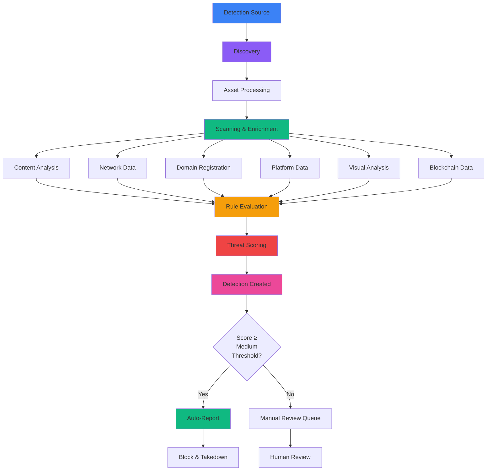

A **detection** is a potential security threat that has been automatically identified by ChainPatrol's monitoring system. When a detection source discovers suspicious content that may be impersonating your brand or attempting to defraud users, it creates a detection record for your security team to review.

## What is a Detection?

Detections represent automated findings from ChainPatrol's continuous monitoring across the internet.

### Components of a Detection

Each detection contains:

<CardGroup cols={3}>
  <Card title="Asset" icon="link">
    The specific URL, social account, or content identified
  </Card>
  
  <Card title="Source" icon="radar">
    Which detection source discovered it
  </Card>
  
  <Card title="Score" icon="gauge">
    Confidence level (0-1) indicating likelihood of being malicious
  </Card>
  
  <Card title="Reason" icon="file-lines">
    Why it was flagged and which rules triggered
  </Card>
  
  <Card title="Organization" icon="building">
    Your organization being targeted
  </Card>
  
  <Card title="Timestamp" icon="clock">
    When the threat was first detected
  </Card>
  
  <Card title="Status" icon="list-check">
    Current state (reported, under review, awaiting action)
  </Card>
</CardGroup>

## Detection Lifecycle

<Steps>
  <Step title="Discovery">
    A detection source finds content matching your monitoring keywords or patterns.
    
    **Example:** Google Search detects a website containing your brand name plus terms like "airdrop" or "claim tokens"
  </Step>
  
  <Step title="Asset Processing">
    The discovered asset is automatically submitted to ChainPatrol's analysis pipeline, where it:
    
    - Creates or retrieves the asset record
    - Validates the asset hasn't already been marked as legitimate (allowed)
    - Checks for duplicate detections
  </Step>
  
  <Step title="Scanning & Enrichment">
    The asset undergoes comprehensive scanning to gather intelligence:
    
    <AccordionGroup>
      <Accordion title="Content Analysis" icon="file-magnifying-glass">
        - Webpage screenshots
        - HTML content
        - Metadata extraction
        - Text and image analysis
      </Accordion>
      
      <Accordion title="Network Data" icon="network-wired">
        - DNS records
        - IP addresses
        - Hosting information
        - CDN and infrastructure
      </Accordion>
      
      <Accordion title="Domain Registration" icon="globe">
        - WHOIS data
        - Registration date
        - Registrar information
        - Historical records
      </Accordion>
      
      <Accordion title="Platform Data" icon="share-nodes">
        - Social media profiles
        - App store information
        - Platform metadata
        - Account details
      </Accordion>
      
      <Accordion title="Visual Analysis" icon="image">
        - Logo detection
        - Similarity matching
        - Brand element identification
        - Visual fingerprinting
      </Accordion>
      
      <Accordion title="Blockchain Data" icon="link">
        - Smart contract analysis
        - Token information
        - Transaction patterns
        - Wallet connections
      </Accordion>
    </AccordionGroup>
  </Step>
  
  <Step title="Rule Evaluation">
    The system executes dozens of detection rules against the enriched asset data.
    
    **Each rule evaluates specific threat indicators:**
    
    <CardGroup cols={2}>
      <Card title="Domain Age" icon="calendar">
        Newly registered domains (< 30 days old)
      </Card>
      
      <Card title="Visual Similarity" icon="image">
        Logo or design mimicking your brand
      </Card>
      
      <Card title="Text Similarity" icon="text">
        URLs or names that closely match yours
      </Card>
      
      <Card title="Threat Intelligence" icon="shield-halved">
        Known malicious infrastructure or patterns
      </Card>
      
      <Card title="Behavioral Indicators" icon="code">
        Wallet drainer code, phishing forms
      </Card>
    </CardGroup>
  </Step>
  
  <Step title="Scoring">
    Based on rule results, the system calculates a **threat score** (0-1) representing confidence that the asset is malicious.
    
    **Score Calculation:**
    
    <Tabs>
      <Tab title="Rule Grouping" icon="layer-group">
        Rules are grouped by category:
        - Visual Similarity
        - Threat Intelligence
        - Domain Age
        - Text Matching
        - Behavioral Analysis
      </Tab>
      
      <Tab title="Confidence Levels" icon="gauge">
        Each rule has a confidence level:
        - Very Low
        - Low
        - Medium
        - High
        - Very High
      </Tab>
      
      <Tab title="Weighted Scoring" icon="calculator">
        - Weighted scores combined across all triggered rules
        - Organization-specific adjustments applied
        - Brand impersonation factors considered
      </Tab>
    </Tabs>
  </Step>
  
  <Step title="Detection Creation">
    A detection record is created in the database with all gathered intelligence
  </Step>
  
  <Step title="Auto-Reporting (Optional)">
    If your organization has auto-reporting enabled and the detection score exceeds your **medium threshold**, the system can automatically:
    
    - Create a report with the detected asset
    - Mark the asset as blocked
    - Submit takedown requests (if configured)
    - Send notifications to your team
    
    <Warning>
    **Auto-Reporting Requirements:**
    - Score must meet or exceed your medium threshold (typically 0.6-0.7)
    - Detection source must be enabled
    - Asset must not already be blocked
    - Asset must not have been previously rejected multiple times
    </Warning>
  </Step>
</Steps>

## Confidence Levels

Detections are categorized into confidence levels based on your organization's thresholds:

<Tabs>
  <Tab title="None" icon="gauge-simple-low">
    **Score:** 0 to Low Threshold (typically < 0.4)
    
    **Description:**
    Low confidence detections. May be false positives or tangentially related to your brand.
    
    **Use case:**
    Useful for monitoring trends but rarely require action.
    
    **Example:**
    - Generic mention of your brand in unrelated context
    - Weak keyword matches
    - Minimal similarity indicators
  </Tab>
  
  <Tab title="Low" icon="gauge-low">
    **Score:** Low Threshold to Medium Threshold (typically 0.4 - 0.6)
    
    **Description:**
    Some indicators suggest a potential threat, but evidence is limited. Requires manual review to confirm.
    
    **Common scenarios:**
    - Domain contains your brand name but has legitimate business purpose
    - Social media mentions your brand in neutral context
    - Weak visual or textual similarity
    
    **Action:** Manual review recommended
  </Tab>
  
  <Tab title="Medium" icon="gauge">
    **Score:** Medium Threshold to High Threshold (typically 0.6 - 0.8)
    
    **Description:**
    Strong indicators of malicious intent. Multiple detection rules triggered with reasonable confidence.
    
    **Common scenarios:**
    - New domain with brand name and suspicious keywords
    - Social media account impersonating your brand with stolen logo
    - Token contract with similar name on blockchain
    
    **Action:** Often eligible for auto-reporting if enabled
    
    <Check>
    This is the typical threshold for automatic reporting and blocking.
    </Check>
  </Tab>
  
  <Tab title="High" icon="gauge-high">
    **Score:** High Threshold and above (typically > 0.8)
    
    **Description:**
    Very strong evidence of malicious activity. Multiple high-confidence rules triggered.
    
    **Common scenarios:**
    - Perfect visual replica of your website
    - Domain nearly identical to yours (typosquatting)
    - Known phishing infrastructure
    - Contains wallet drainer code
    
    **Action:** Typically auto-reported immediately and prioritized for takedown
    
    <Warning>
    High confidence detections require immediate attention and rapid response.
    </Warning>
  </Tab>
</Tabs>

## Understanding Detection Groups

Detections can be grouped together using a **Group ID** to represent related threats discovered from a single source.

### Relationship Extraction

When analyzing an asset, the system may discover additional related threats:

<CardGroup cols={3}>
  <Card title="Linked URLs" icon="link">
    A phishing page that links to multiple other scam domains
  </Card>
  
  <Card title="Redirects" icon="arrow-right-arrow-left">
    A URL that redirects through several malicious domains
  </Card>
  
  <Card title="Related Accounts" icon="users">
    Social media posts that mention multiple scam websites
  </Card>
</CardGroup>

<Info>
All related detections share the same group ID, making it easy to identify and report entire phishing campaigns at once.
</Info>

### Campaign Tracking

Group IDs help you:

<CardGroup cols={2}>
  <Card title="Identify Campaigns" icon="network-wired">
    Recognize coordinated phishing campaigns
  </Card>
  
  <Card title="Track Infrastructure" icon="server">
    Map relationships between threats
  </Card>
  
  <Card title="Report Networks" icon="layer-group">
    Report entire attack networks simultaneously
  </Card>
  
  <Card title="Understand Tactics" icon="brain">
    Analyze attacker tactics and patterns
  </Card>
</CardGroup>

## Deduplication

The system automatically handles duplicate detections to prevent alert fatigue:

<Tabs>
  <Tab title="Same Asset, Same Organization" icon="copy">
    **Scenario:**
    The same asset is detected multiple times by the same source for your organization.
    
    **Behavior:**
    Only one detection record is kept.
    
    **Why:**
    Prevents alert fatigue from repeated discoveries of the same threat.
    
    **Example:**
    - Google Search finds `fake-metamask.com` on Monday
    - Google Search finds `fake-metamask.com` again on Wednesday
    - **Result:** Only the first detection is kept
  </Tab>
  
  <Tab title="Same Asset, Different Sources" icon="radar">
    **Scenario:**
    Multiple detection sources independently find the same threat.
    
    **Behavior:**
    Separate detection records are created.
    
    **Why:**
    This helps you:
    - Validate threat confidence (multiple sources agree)
    - Understand which sources are most effective
    - Track how threats spread across platforms
    
    **Example:**
    - Google Search finds `fake-metamask.com`
    - Twitter monitoring finds `fake-metamask.com`
    - **Result:** Two detection records, higher confidence
  </Tab>
  
  <Tab title="Different Assets, Same Campaign" icon="network-wired">
    **Scenario:**
    Related assets in the same attack campaign.
    
    **Behavior:**
    Linked via group IDs but maintained as separate detections.
    
    **Why:**
    Allows you to:
    - Report each asset individually
    - Track takedown progress per asset
    - Understand campaign scope
    
    **Example:**
    - `fake-metamask.com` (main phishing site)
    - `claim-airdrop.com` (linked from main site)
    - `support-metamask.com` (redirect target)
    - **Result:** Three detections with same group ID
  </Tab>
</Tabs>

## Detection Workflow

## Key Takeaways

<CardGroup cols={2}>
  <Card title="Automated Discovery" icon="robot">
    Detections are automatically identified by monitoring sources
  </Card>
  
  <Card title="Comprehensive Analysis" icon="magnifying-glass">
    Multiple data types analyzed for each detection
  </Card>
  
  <Card title="Confidence Scoring" icon="gauge">
    0-1 score indicates likelihood of being malicious
  </Card>
  
  <Card title="Rule-Based Evaluation" icon="ruler">
    Dozens of rules evaluate threat indicators
  </Card>
  
  <Card title="Group Tracking" icon="network-wired">
    Related threats linked via group IDs
  </Card>
  
  <Card title="Smart Deduplication" icon="copy">
    Prevents alert fatigue while maintaining visibility
  </Card>
  
  <Card title="Auto-Reporting" icon="bolt">
    High-confidence threats can be automatically reported
  </Card>
  
  <Card title="Lifecycle Tracking" icon="timeline">
    Full visibility from discovery to resolution
  </Card>
</CardGroup>

---

<Card
  title="View Your Detections"
  icon="radar"
  href="https://app.chainpatrol.io"
>
  Access your dashboard to review and manage detections
</Card>
