## Definition

<Info>
**Metrics** are the high-level numbers and charts ChainPatrol shows to summarize how many threats we're seeing, how many we've blocked or taken down, and how quickly we're responding over a chosen time period.
</Info>

They are built by aggregating your organization's activity (reports, detections, blocked assets, takedowns) into simple, readable summaries.

### Why It Matters

<Card title="Answer the Key Question" icon="circle-question">
  Metrics help you answer **"Are we protected?"** by showing threat volume, coverage, and response quality to your internal stakeholders and, when enabled, to external audiences via your Security Portal.
</Card>

## Key Characteristics

<Tabs>
  <Tab title="Organization-Specific" icon="building">
    **Tied to your organization**
    
    Metrics are always calculated for a specific **organization**, and reflect only that organization's reports, threats, and takedown activity.
    
    **What this means:**
    - You only see your organization's data
    - No cross-organization visibility
    - Customized to your brands and assets
    - Reflects your specific threat landscape
  </Tab>
  
  <Tab title="Time-Bound" icon="clock">
    **Summary over a period**
    
    Every metrics view uses a time window (e.g., "last 30 days" or a custom range chosen via the date filter).
    
    **Common time periods:**
    - Last 7 days
    - Last 30 days
    - Last 90 days
    - Custom date range
    
    <Note>
    The same metric (e.g., "New Threats") may look very different depending on the period you select.
    </Note>
  </Tab>
  
  <Tab title="Filterable" icon="filter">
    **Segmented by multiple dimensions**
    
    Many metrics can be filtered by **brand** and broken down by:
    
    <CardGroup cols={2}>
      <Card title="Asset Type" icon="layer-group">
        - Domains
        - Twitter/X
        - Telegram
        - Other platforms
      </Card>
      
      <Card title="Threat Category" icon="tags">
        - Brand impersonation
        - Employee impersonation
        - General phishing
        - Specific attack types
      </Card>
    </CardGroup>
  </Tab>
  
  <Tab title="Components" icon="cubes">
    **What they contain**
    
    <AccordionGroup>
      <Accordion title="Counts" icon="hashtag">
        - Reports received
        - New threats blocked
        - Threats on watchlist
        - Takedowns filed
        - Takedowns completed
      </Accordion>
      
      <Accordion title="Breakdowns" icon="chart-pie">
        - Threats by asset type
        - Threats per brand
        - Detections by source
        - Category distributions
      </Accordion>
      
      <Accordion title="Timelines and Speed" icon="chart-line">
        - Threats blocked per day
        - Takedowns completed per day
        - Median time to takedown
        - Trend analysis
      </Accordion>
    </AccordionGroup>
  </Tab>
</Tabs>

## What Lives Inside Metrics

### Core Volume Metrics

<CardGroup cols={3}>
  <Card title="Reports" icon="flag">
    How many submissions your organization received from users, partners, and integrations
  </Card>
  
  <Card title="New Threats" icon="shield-xmark">
    How many assets were blocked as threats (domains, social profiles, Telegram channels, etc.)
  </Card>
  
  <Card title="Threats Watchlisted" icon="eye">
    Threats you're actively watching (takedowns not appropriate or on hold)
  </Card>
  
  <Card title="Takedowns Filed" icon="paper-plane">
    How many takedown requests your organization has initiated
  </Card>
  
  <Card title="Takedowns Completed" icon="circle-check">
    How many takedown requests have been successfully resolved
  </Card>
</CardGroup>

### Threat Breakdowns

<Tabs>
  <Tab title="By Asset Type" icon="layer-group">
    **Platform-specific threat counts**
    
    <AccordionGroup>
      <Accordion title="Domain Threats" icon="globe">
        Blocked malicious domains and URLs
        
        **Includes:**
        - Phishing websites
        - Fake landing pages
        - Impersonation sites
        - Malicious web applications
      </Accordion>
      
      <Accordion title="Twitter Threats" icon="x-twitter">
        Blocked threats on Twitter/X
        
        **Includes:**
        - Impersonation accounts
        - Scam posts
        - Fake support accounts
        - Fraudulent giveaways
      </Accordion>
      
      <Accordion title="Telegram Threats" icon="telegram">
        Blocked threats on Telegram
        
        **Includes:**
        - Fake support channels
        - Scam groups
        - Impersonation accounts
        - Phishing bots
      </Accordion>
      
      <Accordion title="Other Threats" icon="ellipsis">
        Blocked threats on all other supported surfaces
        
        **Includes:**
        - App stores
        - Other social networks (Discord, Reddit, etc.)
        - Developer platforms (GitHub, npm)
        - Email addresses
        - Blockchain addresses
      </Accordion>
    </AccordionGroup>
  </Tab>
  
  <Tab title="By Brand" icon="building">
    **Brand-specific targeting**
    
    Threats blocked per brand inside your organization, showing which brands are targeted more heavily.
    
    **Use cases:**
    - Identify most-targeted brands
    - Allocate protection resources
    - Track brand-specific campaigns
    - Compare threat levels across portfolio
    
    **Example visualization:**
    ```
    Brand A: 150 threats (45%)
    Brand B: 100 threats (30%)
    Brand C: 85 threats (25%)
    ```
  </Tab>
</Tabs>

### Time-Series and Speed Metrics

<AccordionGroup>
  <Accordion title="Threats Blocked Per Day" icon="chart-line">
    **Daily threat volume over time**
    
    Shows how many assets were blocked on each day in the selected range.
    
    **Insights:**
    - Identify threat spikes
    - Track seasonal patterns
    - Measure detection effectiveness
    - Spot coordinated campaigns
    
    **Visualization:** Line chart showing daily counts
  </Accordion>
  
  <Accordion title="Takedowns Completed Per Day" icon="chart-bar">
    **Daily takedown completion rate**
    
    Shows how many takedowns reached "completed" status on each day.
    
    **Insights:**
    - Track takedown velocity
    - Measure provider responsiveness
    - Identify bottlenecks
    - Monitor team efficiency
    
    **Visualization:** Bar chart showing daily completions
  </Accordion>
  
  <Accordion title="Median Time to Takedown" icon="stopwatch">
    **Speed of threat removal**
    
    Calculated from when a takedown request is created to when it is first marked completed.
    
    **Available breakdowns:**
    - Overall median
    - By asset type (domains, social media, etc.)
    - By threat category (brand vs. employee impersonation)
    
    **Example:**
    - Overall: 36 hours
    - Domains: 48 hours
    - Social media: 24 hours
    - Telegram: 18 hours
    
    <Tip>
    Lower median times indicate faster threat removal and better provider relationships.
    </Tip>
  </Accordion>
</AccordionGroup>

## How Metrics Relate to Other Concepts

<AccordionGroup>
  <Accordion title="Assets and Asset Scans" icon="magnifying-glass">
    **From scans to metrics**
    
    When asset scans and reviews lead to an asset being **blocked**, that asset contributes to metrics such as:
    - **New Threats**
    - **Threats by asset type**
    - **Threats blocked per day**
    
    Ongoing scans and liveness updates ensure that metrics reflect the current state of your threat surface (e.g., how many blocked assets are still alive).
  </Accordion>
  
  <Accordion title="Threats / Detections" icon="radar">
    **Detection to metric pipeline**
    
    Every detection or blocked asset rolls up into counts like:
    - **New threats**
    - **Detections by type**
    - **Domains blocked**
    
    Metrics summarize how much malicious activity is being found and neutralized for your organization over time.
  </Accordion>
  
  <Accordion title="Reports and Reviews" icon="clipboard-check">
    **From reports to action**
    
    - **Reports** raised by your team or users drive the **Reports** metric
    - Review outcomes (e.g., approving a threat as real and blocking it) flow into threat and takedown metrics
    - Shows how well your review process is keeping up with incoming threats
  </Accordion>
  
  <Accordion title="Takedowns" icon="power-off">
    **Takedown effectiveness**
    
    Takedown records power:
    - **Takedowns Filed** and **Takedowns Completed**
    - **Median time to takedown** per asset type and category
    
    These metrics show how quickly threats are being removed once identified.
  </Accordion>
  
  <Accordion title="Brands and Services" icon="building">
    **Service impact on visibility**
    
    - Metrics can be filtered by **brand** to show which brands are most targeted
    - Enabling services like **detection**, **reviewing**, **takedowns**, and **wallet blocking** typically increases visibility in metrics (more threats found, blocked, and removed) rather than reducing numbers to zero
    
    <Note>
    Higher threat counts don't mean you're less secure—they mean you're detecting more threats that were always there.
    </Note>
  </Accordion>
</AccordionGroup>

## Examples

<Tabs>
  <Tab title="Example 1: Quarterly Threat Overview" icon="chart-line">
    **Scenario:** Executive reporting
    
    <Steps>
      <Step title="Select Time Period">
        You select "Last 90 days" on the Metrics page
      </Step>
      
      <Step title="Review Dashboard">
        The dashboard shows:
        - Reports received: 245
        - New threats blocked: 187
        - Takedowns filed: 142
        - Takedowns completed: 128
        - Plus charts of threats blocked per day
      </Step>
      
      <Step title="Share with Leadership">
        You share these numbers with leadership to summarize how much malicious activity was detected and what action was taken
      </Step>
    </Steps>
    
    **Key insights:**
    - 76% of reports resulted in blocked threats
    - 90% of takedowns were completed
    - Average of 2 threats blocked per day
    - Clear demonstration of protection value
  </Tab>
  
  <Tab title="Example 2: Domains vs. Social Threats" icon="chart-pie">
    **Scenario:** Threat landscape analysis
    
    <Steps>
      <Step title="Compare Asset Types">
        You compare threat counts for the last month:
        - **Domain Threats**: 45 (down from 60 last month)
        - **Twitter Threats**: 30 (stable)
        - **Telegram Threats**: 55 (up from 35 last month)
        - **Other Threats**: 20 (stable)
      </Step>
      
      <Step title="Identify Trend">
        You see that domain threats have decreased while Telegram threats have increased
      </Step>
      
      <Step title="Adjust Strategy">
        You adjust your monitoring and communication plans:
        - Increase Telegram monitoring frequency
        - Alert community about Telegram scams
        - Investigate why attackers shifted platforms
      </Step>
    </Steps>
    
    **Key insights:**
    - Attackers are shifting to Telegram
    - Domain blocking is working (deterrent effect)
    - Need to enhance Telegram-specific defenses
    - Community education opportunity
  </Tab>
  
  <Tab title="Example 3: Takedown Speed Analysis" icon="stopwatch">
    **Scenario:** Provider performance review
    
    **Median time to takedown by asset type:**
    - Domains: 48 hours
    - Twitter: 24 hours
    - Telegram: 18 hours
    - App stores: 72 hours
    
    **Insights:**
    - Social platforms respond faster than hosting providers
    - App stores have longest response times
    - Telegram is most responsive
    
    **Actions:**
    - Focus on improving domain takedown speed
    - Investigate app store delays
    - Document Telegram best practices
    - Consider alternative providers for slow responders
  </Tab>
</Tabs>

## Metrics Dashboard Layout

```mermaid
graph TD
    Dashboard[Metrics Dashboard] --> Filters[Time & Brand Filters]
    Dashboard --> Volume[Volume Metrics]
    Dashboard --> Breakdown[Threat Breakdowns]
    Dashboard --> Timeline[Time-Series Charts]
    Dashboard --> Speed[Speed Metrics]
    
    Volume --> Reports[Reports]
    Volume --> NewThreats[New Threats]
    Volume --> Watchlist[Watchlisted]
    Volume --> Filed[Takedowns Filed]
    Volume --> Completed[Takedowns Completed]
    
    Breakdown --> AssetType[By Asset Type]
    Breakdown --> Brand[By Brand]
    Breakdown --> Category[By Category]
    
    Timeline --> BlockedPerDay[Threats Blocked/Day]
    Timeline --> CompletedPerDay[Takedowns Completed/Day]
    
    Speed --> MedianTime[Median Time to Takedown]
    Speed --> ByType[By Asset Type]
    Speed --> ByCategory[By Threat Category]
    
    style Dashboard fill:#6622DC
    style Volume fill:#3b82f6
    style Breakdown fill:#8b5cf6
    style Timeline fill:#10b981
    style Speed fill:#f59e0b
```



---

## Key Takeaways

<CardGroup cols={2}>
  <Card title="High-Level Summary" icon="chart-line">
    Metrics aggregate activity into readable summaries
  </Card>
  
  <Card title="Organization-Specific" icon="building">
    Always calculated for your specific organization
  </Card>
  
  <Card title="Time-Bound" icon="clock">
    Every view uses a specific time window
  </Card>
  
  <Card title="Filterable" icon="filter">
    Break down by brand, asset type, and category
  </Card>
  
  <Card title="Volume Tracking" icon="hashtag">
    Reports, threats, watchlist, and takedowns
  </Card>
  
  <Card title="Threat Breakdowns" icon="chart-pie">
    By asset type, brand, and category
  </Card>
  
  <Card title="Speed Metrics" icon="stopwatch">
    Median time to takedown and daily trends
  </Card>
  
  <Card title="Actionable Insights" icon="lightbulb">
    Identify trends and adjust protection strategies
  </Card>
</CardGroup>

---

<Card
  title="View Your Metrics"
  icon="chart-bar"
  href="https://app.chainpatrol.io"
>
  Access your dashboard to explore metrics and analyze your threat landscape
</Card>
