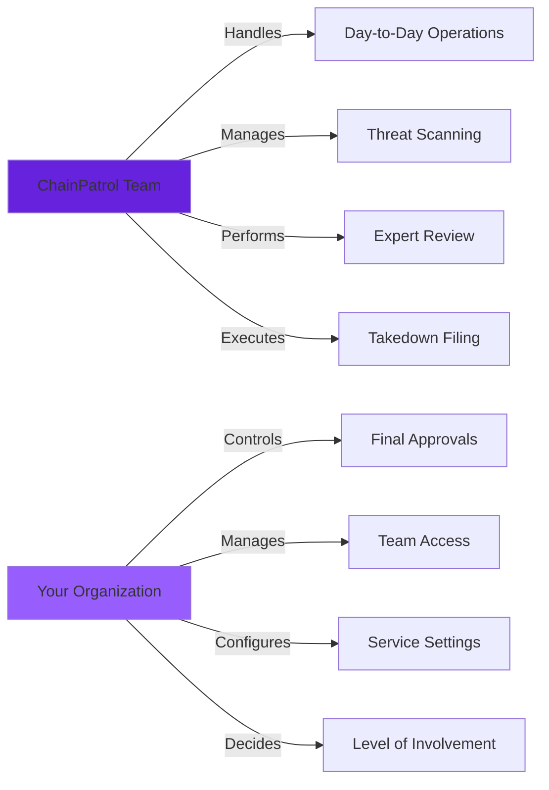

## Your Workspace in ChainPatrol

Everything you see and do in ChainPatrol happens inside an **Organization**. Think of it as your team's dedicated workspace where you manage your brands, track your assets, and measure how ChainPatrol is protecting you from threats.

<Info>
An organization is the top-level container for all your security operations, team members, and protected assets in ChainPatrol.
</Info>

## How ChainPatrol Manages Security for You

ChainPatrol is a **fully managed security product**. This means our team handles the heavy lifting:

<CardGroup cols={2}>
  <Card title="Day-to-Day Threat Hunting" icon="magnifying-glass">
    Continuous scanning across platforms
  </Card>
  
  <Card title="Suspicious Activity Review" icon="clipboard-check">
    Expert analysis of potential threats
  </Card>
  
  <Card title="Attack Analysis" icon="shield-halved">
    Detailed evaluation of threat patterns
  </Card>
  
  <Card title="Takedown Filing" icon="gavel">
    Professional requests to providers and platforms
  </Card>
</CardGroup>

<Check>
You don't need to become a security expert or dedicate staff to monitor threats around the clock. We do that work for you.
</Check>

### Your Level of Involvement

That said, you're not locked out of the process. If you want your team to be more hands-on, you can:

<Tabs>
  <Tab title="Team Access" icon="users">
    **Invite Members**
    
    Invite team members into your organization's dashboard with customized permissions and roles.
  </Tab>
  
  <Tab title="Threat Reporting" icon="flag">
    **Report Threats**
    
    Your team can report threats they discover through the dashboard or integrations.
  </Tab>
  
  <Tab title="Approval Workflow" icon="check-double">
    **Approve or Decline**
    
    Review and approve specific takedowns or blocklist decisions before they take effect.
  </Tab>
  
  <Tab title="Integrations" icon="plug">
    **Connect Tools**
    
    Integrate Slack, Telegram, SSO, and other tools to fit ChainPatrol into your existing workflows.
  </Tab>
</Tabs>

<Note>
You decide how involved you want to be—from fully hands-off to deeply integrated with your team's operations.
</Note>

## Brands and Assets

Every organization has one or more **brands** that ChainPatrol protects.

### What is a Brand?

<AccordionGroup>
  <Accordion title="Brand Definition" icon="building">
    A brand could be:
    - Your company name
    - A product line
    - Your executives or key personnel
    - A key identity that attackers might try to impersonate
  </Accordion>
  
  <Accordion title="Brand Impersonation Detection" icon="user-secret">
    We use brands to detect **brand impersonation** attacks:
    - Lookalike domains
    - Fake social profiles
    - Scam campaigns borrowing your brand's name
    - Imagery or messaging designed to trick people
  </Accordion>
</AccordionGroup>

### What are Assets?

In addition to brands, your organization also has **assets**—the digital properties that actually belong to you:

<CardGroup cols={3}>
  <Card title="Websites" icon="globe">
    Domains and web applications
  </Card>
  
  <Card title="Social Accounts" icon="share-nodes">
    Twitter, Discord, Telegram, etc.
  </Card>
  
  <Card title="App Listings" icon="mobile">
    App store and extension marketplace listings
  </Card>
  
  <Card title="Wallet Addresses" icon="wallet">
    Blockchain addresses and contracts
  </Card>
  
  <Card title="Email Addresses" icon="envelope">
    Official company and team emails
  </Card>
  
  <Card title="Other Properties" icon="link">
    GitHub repos, forums, documentation sites
  </Card>
</CardGroup>

<Info>
We track your official assets so we can spot copycats and **general phishing** pages that mimic your legitimate sites or channels. When we find something suspiciously similar to your assets but not actually yours, it gets flagged for review.
</Info>

## Services You Can Enable

Each organization can turn individual services on or off depending on what you need. These services control which ChainPatrol features are active for your organization:

<AccordionGroup>
  <Accordion title="Detection" icon="magnifying-glass">
    Enables ChainPatrol's automated scanning across the web, social platforms, app stores, and other sources. When this is turned on, we continuously look for new threats targeting your brands.
    
    **Status:** Foundation service—required for all other services
  </Accordion>
  
  <Accordion title="Monitoring & Reporting" icon="chart-line">
    Activates the systems that collect and organize reports and detections into a single view. This powers your dashboards and ensures you have up-to-date visibility into what's happening.
    
    **Status:** Recommended for all organizations
  </Accordion>
  
  <Accordion title="Reviewing" icon="clipboard-check">
    Turns on ChainPatrol's review workflows, where our team validates suspicious assets and decides whether they should be blocked, allowed, watchlisted, or escalated.
    
    **Status:** Recommended for accuracy and quality control
  </Accordion>
  
  <Accordion title="Obligatory Organization Admin Approval" icon="user-shield">
    Adds a final approval step for specific types of assets. When enabled, you choose which asset categories (like domains, social media, or messaging platforms) require explicit confirmation from an admin in your organization before ChainPatrol's blocklist decisions take effect.
    
    **Configuration:** If you don't select any specific types, all asset types will require approval.
    
    **Status:** Optional—for organizations requiring internal oversight
  </Accordion>
  
  <Accordion title="Wallet Blocking" icon="wallet">
    Allows approved crypto-related threats to be added to ChainPatrol's global blocklist, which is consumed by partner wallets like Coinbase Wallet and MetaMask to protect their users from known malicious addresses.
    
    **Status:** Essential for Web3 organizations
  </Accordion>
  
  <Accordion title="Takedowns" icon="power-off">
    Enables ChainPatrol to file takedown requests with hosting providers, registrars, and platforms on your behalf. When this service is on, we don't just block threats—we work to get them removed from the internet entirely.
    
    **Requirements:** Legal documentation (trademark proof, authorized representative details)
    
    **Status:** Recommended for comprehensive protection
  </Accordion>
  
  <Accordion title="Automated Takedowns" icon="bolt">
    Speeds up the takedown process for clear-cut cases. Once you've provided the required legal documents (like a Power of Attorney) and your main website URL, ChainPatrol can automatically submit takedown requests for approved threats without waiting for manual back-and-forth on every case.
    
    **Requirements:** 
    - Power of Attorney document
    - Main website URL
    - All other services enabled
    
    **Status:** Advanced—for high-volume threat environments
  </Accordion>
</AccordionGroup>

<Tip>
Learn more about configuring these services in our [Services Setup guide](/protect-your-brand/services-setup).
</Tip>

## Members, Roles, and Permissions

You control who can access your organization and what they're allowed to do.

### How It Works

<Steps>
  <Step title="Invite Team Members">
    Invite team members into your organization's dashboard
  </Step>
  
  <Step title="Assign Roles">
    Assign them roles that determine their access level
  </Step>
  
  <Step title="Set Permissions">
    Configure specific permissions for what they can do
  </Step>
  
  <Step title="Maintain Control">
    Retain ultimate control over approvals and sensitive actions
  </Step>
</Steps>

### What Permissions Control

<CardGroup cols={2}>
  <Card title="Threat Reporting" icon="flag">
    Ability to report and submit threats
  </Card>
  
  <Card title="Blocklist Approvals" icon="shield-check">
    Approve or reject blocklist changes
  </Card>
  
  <Card title="Settings Management" icon="gear">
    Modify organization settings and configuration
  </Card>
  
  <Card title="Sensitive Information" icon="eye">
    View confidential data and reports
  </Card>
  
  <Card title="Service Control" icon="toggle-on">
    Enable or disable organization services
  </Card>
  
  <Card title="Member Management" icon="users">
    Invite, remove, or modify team members
  </Card>
</CardGroup>

<Warning>
This permission system ensures that potentially destructive actions—like turning on Wallet Blocking or Automated Takedowns—only happen with your organization's explicit permission.
</Warning>

### Division of Responsibility

<Check>
ChainPatrol's staff handle the day-to-day security operations, but you retain ultimate control over approvals, visibility, and how the platform integrates with your team.
</Check>

## Organization Structure

### Typical Organization Hierarchy

<Tabs>
  <Tab title="Single Brand" icon="building">
    **Simple Structure**
    
    Most organizations have a single brand:
    - One company identity
    - All assets under one brand
    - Straightforward management
    
    **Example:** A startup protecting their main product
  </Tab>
  
  <Tab title="Multiple Brands" icon="sitemap">
    **Complex Structure**
    
    Some organizations manage multiple brands:
    - Parent company + subsidiaries
    - Multiple product lines
    - Acquired companies
    - Regional brands
    
    **Example:** A holding company protecting multiple portfolio companies
  </Tab>
  
  <Tab title="Enterprise" icon="building-columns">
    **Advanced Structure**
    
    Large enterprises may have:
    - Multiple brands
    - Hundreds or thousands of assets
    - Complex approval workflows
    - Multiple teams with different permissions
    
    **Example:** A Fortune 500 company with global operations
  </Tab>
</Tabs>

---

## Key Takeaways

<CardGroup cols={2}>
  <Card title="Centralized Workspace" icon="building">
    Everything happens within your organization
  </Card>
  
  <Card title="Fully Managed" icon="hands-helping">
    ChainPatrol handles day-to-day operations
  </Card>
  
  <Card title="Flexible Involvement" icon="sliders">
    Choose your level of hands-on participation
  </Card>
  
  <Card title="Configurable Services" icon="toggle-on">
    Enable only what you need
  </Card>
  
  <Card title="Granular Permissions" icon="lock">
    Control who can do what
  </Card>
  
  <Card title="You're in Control" icon="user-shield">
    Final say on all critical decisions
  </Card>
</CardGroup>

---

<Card
  title="Set Up Your Organization"
  icon="rocket"
  href="https://app.chainpatrol.io"
>
  Access your organization dashboard to configure services and invite team members
</Card>
