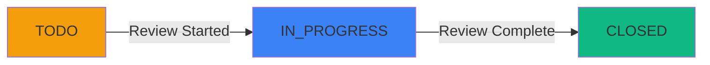

## What is a Report?

A **Report** is how suspicious or safe activity gets submitted to ChainPatrol for review. Each report bundles together one or more assets, like websites, social profiles, or crypto addresses, along with the evidence needed to evaluate them.

<Info>
When you create a report, you're proposing that specific assets should either be **blocked** (because they're malicious) or **allowed** (because they're safe).
</Info>

### What a Report Contains

<CardGroup cols={3}>
  <Card title="Assets" icon="link">
    One or more URLs, profiles, or addresses
  </Card>
  
  <Card title="Context" icon="file-lines">
    Title and description explaining the threat
  </Card>
  
  <Card title="Evidence" icon="image">
    Screenshots and supporting materials
  </Card>
</CardGroup>

## When Reports Get Created

Reports flow into ChainPatrol from multiple sources:

<Tabs>
  <Tab title="Manual Submission" icon="user">
    **Your team or ChainPatrol staff** can create reports directly in the dashboard whenever they spot something suspicious.
    
    **Who can create:**
    - Organization members
    - ChainPatrol staff
    - Security team members
    
    **When to use:**
    - Discovered threats
    - Community-reported issues
    - Proactive monitoring
  </Tab>
  
  <Tab title="Public Portal" icon="globe">
    **From your community** when your organization has a public Security Portal enabled, anyone can submit a report.
    
    **How it works:**
    - Public submission form
    - Automatically flagged as customer report
    - No login required
    
    **Benefits:**
    - Community-powered detection
    - Early threat discovery
    - User engagement
  </Tab>
  
  <Tab title="API Integration" icon="code">
    **Through the API** if you have integrations or partners that need to submit threats programmatically.
    
    **Use cases:**
    - Automated monitoring tools
    - Partner integrations
    - Custom workflows
    - Bulk submissions
    
    <Tip>
    See our [API documentation](/external-api/report-create) for integration details.
    </Tip>
  </Tab>
  
  <Tab title="Automated Detection" icon="robot">
    **From automated detection** where ChainPatrol's systems continuously scan the web, social platforms, and other sources for threats.
    
    **How it works:**
    - Continuous monitoring
    - Automatic report creation
    - Pre-analyzed evidence
    - Instant submission
    
    **Coverage:**
    - 50+ platforms monitored
    - 24/7 scanning
    - Real-time detection
  </Tab>
</Tabs>

## How Reports Get Reviewed

Every report that comes into your organization is reviewed by ChainPatrol's team.

<Steps>
  <Step title="Evidence Review">
    Reviewers examine the evidence, screenshots, and context provided
  </Step>
  
  <Step title="Security Checks">
    Run automated security scans and analysis on the reported assets
  </Step>
  
  <Step title="Decision">
    Decide whether each asset should be:
    - **Blocked** - Confirmed malicious
    - **Allowed** - Confirmed legitimate
    - **Watchlisted** - Monitored for changes
    - **Escalated** - Requires additional investigation
  </Step>
  
  <Step title="Action">
    Apply the decision and update asset status
  </Step>
</Steps>

### Automatic Review

In some cases, the review happens automatically:

<AccordionGroup>
  <Accordion title="High Confidence Detection" icon="shield-check">
    When our systems have extremely high confidence that an asset is malicious.
    
    **Examples:**
    - Known wallet drainer script detected
    - Exact copy of known phishing site
    - Matches multiple high-confidence rules
    
    **Result:** Approved immediately without manual validation
  </Accordion>
  
  <Accordion title="Trusted Reporter" icon="user-shield">
    When the report comes from someone we've marked as a trusted reporter.
    
    **Who qualifies:**
    - Verified security researchers
    - Trusted partner organizations
    - ChainPatrol staff
    
    **Result:** Fast-tracked for approval
  </Accordion>
</AccordionGroup>

### Organization Admin Approval

<Warning>
If you've enabled **Obligatory Organization Admin Approval** for certain types of assets, there's an extra step.
</Warning>

Even after ChainPatrol's team approves a report, the changes won't be applied to your blocklist until someone from your organization with admin permissions confirms them.

<Steps>
  <Step title="ChainPatrol Review">
    Our team reviews and approves the report
  </Step>
  
  <Step title="Pending Admin Approval">
    Report waits for organization admin confirmation
  </Step>
  
  <Step title="Admin Confirms">
    Your admin reviews and approves or rejects
  </Step>
  
  <Step title="Action Applied">
    Asset status is updated based on final decision
  </Step>
</Steps>

## Report Status

Reports move through three stages as they're processed:

<CardGroup cols={3}>
  <Card title="TODO" icon="circle" color="#f59e0b">
    The report is waiting in the queue for review
  </Card>
  
  <Card title="IN_PROGRESS" icon="spinner" color="#3b82f6">
    ChainPatrol staff or automated systems are actively reviewing it
  </Card>
  
  <Card title="CLOSED" icon="circle-check" color="#10b981">
    The review is complete and decisions have been made on all assets
  </Card>
</CardGroup>

### Status Transitions

## Finding Your Reports

The **Reports page** in your dashboard shows all the reports for your organization, whether they're pending review, currently being worked on, or already closed.

### Filtering and Search

<CardGroup cols={2}>
  <Card title="By Creator" icon="user">
    Find reports by who created them
  </Card>
  
  <Card title="By Date" icon="calendar">
    Filter by submission date
  </Card>
  
  <Card title="By Asset" icon="link">
    Search for specific assets
  </Card>
  
  <Card title="By Status" icon="filter">
    View TODO, IN_PROGRESS, or CLOSED reports
  </Card>
</CardGroup>

<Info>
This makes it easy to track the status of something you reported or follow up on threats that were flagged by your community.
</Info>

## How to Submit a Report

Creating a report in ChainPatrol is straightforward:

<Steps>
  <Step title="Click Create Report">
    Start by clicking **Create Report** from the dashboard
  </Step>
  
  <Step title="Add Assets">
    Paste in the assets you want to report, one per line:
    - URLs (e.g., `https://fake-metamask.com`)
    - Social media profiles (e.g., `@fake_support`)
    - Blockchain addresses (e.g., `0x123...`)
    - Any other asset type ChainPatrol monitors
    
    <Note>
    The system automatically figures out what kind of asset each one is, so you don't need to categorize them yourself.
    </Note>
  </Step>
  
  <Step title="Add Context">
    Provide information to help reviewers:
    
    **Title:**
    - Summarize what you're reporting
    - Be clear and concise
    - Example: "Fake MetaMask wallet drainer site"
    
    **Description:**
    - Explain why these assets are suspicious
    - Include any relevant details
    - Describe how you found them
    - Note any user reports or complaints
  </Step>
  
  <Step title="Upload Evidence">
    If you have screenshots or other visual evidence, upload them:
    - Screenshots of malicious content
    - User reports or messages
    - Social media posts
    - Any supporting documentation
    
    <Tip>
    Visual evidence helps reviewers quickly understand what's going on and speeds up the review process.
    </Tip>
  </Step>
  
  <Step title="Submit">
    Hit **Submit** and your report goes into the review queue
  </Step>
</Steps>

### What Happens Next

<Tabs>
  <Tab title="Immediate" icon="bolt">
    **Right After Submission:**
    - Report enters TODO status
    - You receive confirmation
    - Report appears in your dashboard
    - ChainPatrol team is notified
  </Tab>
  
  <Tab title="Review Phase" icon="magnifying-glass">
    **During Review:**
    - Status changes to IN_PROGRESS
    - Assets are scanned and analyzed
    - Evidence is evaluated
    - Decisions are made
  </Tab>
  
  <Tab title="Completion" icon="check">
    **After Review:**
    - Status changes to CLOSED
    - Asset statuses are updated
    - You're notified of the outcome
    - Actions are taken (blocking, allowing, etc.)
  </Tab>
</Tabs>

## Report Best Practices

<AccordionGroup>
  <Accordion title="Provide Clear Context" icon="file-lines">
    The more context you provide, the faster and more accurate the review will be.
    
    **Include:**
    - How you discovered the threat
    - Why you believe it's malicious
    - Any user reports or complaints
    - Timeline of when it appeared
  </Accordion>
  
  <Accordion title="Include Visual Evidence" icon="image">
    Screenshots are extremely valuable for reviewers.
    
    **Capture:**
    - The full page or profile
    - Specific malicious elements
    - User-facing content
    - Before it gets taken down
  </Accordion>
  
  <Accordion title="Report Promptly" icon="clock">
    The sooner you report a threat, the sooner it can be blocked.
    
    **Why it matters:**
    - Faster protection for users
    - Less time for scammers to operate
    - Better chance of successful takedown
  </Accordion>
  
  <Accordion title="Group Related Assets" icon="layer-group">
    If multiple assets are part of the same campaign, report them together.
    
    **Benefits:**
    - Reviewers see the full picture
    - More efficient review process
    - Better threat intelligence
    - Coordinated response
  </Accordion>
</AccordionGroup>

---

## Key Takeaways

<CardGroup cols={2}>
  <Card title="Bundle Assets" icon="layer-group">
    Reports can contain multiple related assets
  </Card>
  
  <Card title="Multiple Sources" icon="arrows-to-circle">
    Created manually, via API, or automatically
  </Card>
  
  <Card title="Expert Review" icon="user-shield">
    ChainPatrol team reviews every report
  </Card>
  
  <Card title="Three Statuses" icon="list-check">
    TODO, IN_PROGRESS, CLOSED
  </Card>
  
  <Card title="Easy Submission" icon="paper-plane">
    Simple process with automatic asset detection
  </Card>
  
  <Card title="Context Matters" icon="lightbulb">
    More evidence = faster, better review
  </Card>
</CardGroup>

---

<Card
  title="Submit a Report"
  icon="flag"
  href="https://app.chainpatrol.io"
>
  Access your dashboard to create and track reports
</Card>
