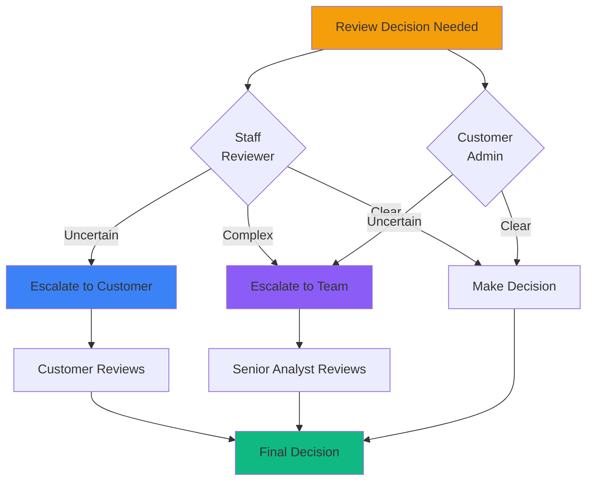

## What is a Review?

A **review** is a decision made on a **proposal** to either block or allow a reported asset. When someone reports a potentially malicious website, social media account, or other digital asset, ChainPatrol creates a proposal that requires review before taking action.

<Info>
Think of a review as the approval or rejection of a recommendation to block a threat.
</Info>

### Components of a Review

Each review consists of:

<CardGroup cols={3}>
  <Card title="Decision" icon="check-double">
    Approve, reject, skip, or escalate
  </Card>
  
  <Card title="Label" icon="tag">
    Type of threat (e.g., phishing, brand impersonation)
  </Card>
  
  <Card title="Comment" icon="comment">
    Optional reasoning explanation
  </Card>
  
  <Card title="Reviewer" icon="user">
    Who made the decision
  </Card>
  
  <Card title="Timestamp" icon="clock">
    When the review was made
  </Card>
</CardGroup>

## Who Can Review?

Several types of users can make reviews:

<Tabs>
  <Tab title="ChainPatrol Staff" icon="shield">
    **Our security analysts** who review reports for all customers
    
    **Capabilities:**
    - Review all reports
    - Create, read, and delete reviews
    - Apply expert threat analysis
    - Handle complex cases
  </Tab>
  
  <Tab title="Trusted Reporters" icon="user-shield">
    **Verified security researchers and partners** who have demonstrated expertise in threat identification
    
    **Capabilities:**
    - Submit high-confidence reports
    - Auto-approval for trusted submissions
    - Create and read reviews
    - Fast-track threat blocking
  </Tab>
  
  <Tab title="Customer Administrators" icon="user-tie">
    **Admins and owners** of customer organizations who can review reports for their own brand
    
    **Capabilities:**
    - Review reports for their organization
    - Approve or reject proposals
    - Final say on blocklist decisions
    - Override escalations
  </Tab>
  
  <Tab title="Automated System" icon="robot">
    **Our automation system** that can auto-approve certain high-confidence threats
    
    **Capabilities:**
    - Instant review of clear threats
    - Threat score calculation
    - Pattern recognition
    - 24/7 operation
  </Tab>
</Tabs>

## Review Actions

There are four types of review decisions:

<AccordionGroup>
  <Accordion title="Approve" icon="circle-check" defaultOpen>
    **What it means:**
    
    Confirms that the reported asset is malicious and should be blocked.
    
    **What happens:**
    - Asset is added to ChainPatrol's blocklist
    - Distributed to integrated platforms
    - Takedown process initiated (if enabled)
    - Organization is notified
    
    **When to use:**
    - Clear evidence of malicious activity
    - High confidence in threat assessment
    - Asset matches known attack patterns
  </Accordion>
  
  <Accordion title="Reject" icon="circle-xmark">
    **What it means:**
    
    Indicates the reported asset is legitimate and should not be blocked.
    
    **Common reasons:**
    - The asset is actually official (false positive)
    - The threat has already been removed
    - Insufficient evidence of malicious activity
    - Misidentification or misunderstanding
    
    **What happens:**
    - Proposal is closed
    - Asset remains unblocked
    - Reporter may be notified
  </Accordion>
  
  <Accordion title="Skip" icon="forward">
    **What it means:**
    
    Reviewer cannot make a definitive decision yet. This keeps the proposal in a pending state for another reviewer to examine.
    
    **Common reasons:**
    - Insufficient evidence to confirm or deny the threat
    - Need for additional context or investigation
    - Waiting for asset to load or become accessible
    - Requires more specialized expertise
    
    **What happens:**
    - Proposal remains in queue
    - Another reviewer will examine it
    - May be escalated if skipped multiple times
  </Accordion>
  
  <Accordion title="Escalate" icon="arrow-up">
    **What it means:**
    
    Passes the review decision to another party for final judgment.
    
    **Escalation Types:**
    
    <Tabs>
      <Tab title="Escalate to Customer">
        Requests the brand owner to review and decide
        
        **When used:**
        - Staff reviewers are uncertain
        - Asset type requires customer approval
        - Content is ambiguous
        
        **What happens:**
        - Customer team receives notifications (Slack/Discord)
        - Proposal stays pending until customer decides
      </Tab>
      
      <Tab title="Escalate to Team">
        Passes to senior ChainPatrol analysts
        
        **When used:**
        - Customer administrators are uncertain
        - Complex cases require expert review
        - Multiple conflicting signals
        
        **What happens:**
        - Routes to senior security analysts
        - In-depth analysis performed
        - Final decision made by experts
      </Tab>
    </Tabs>
  </Accordion>
</AccordionGroup>

## Automated Review

The ChainPatrol automation system automatically reviews proposals under specific conditions:

### Auto-Approval Criteria

A proposal is **automatically approved** when:

<Steps>
  <Step title="Trusted Reporter Submissions">
    Reports from trusted reporters are auto-approved if they don't trigger legitimacy warnings
  </Step>
  
  <Step title="High Threat Score">
    Reports with a threat score of **1.0 or higher** are auto-approved if:
    - No legitimacy checks indicate the asset is legitimate
    - The organization doesn't require customer approval
    - There's no active dispute on the report
  </Step>
</Steps>

### Auto-Skip Criteria

A proposal is **automatically skipped** (sent for manual review) when:

<CardGroup cols={2}>
  <Card title="Legitimacy Detected" icon="shield-check">
    High-confidence rules indicate the asset appears legitimate
  </Card>
  
  <Card title="Low Threat Score" icon="gauge-low">
    The threat score is below 1.0
  </Card>
  
  <Card title="Customer Review Required" icon="user-check">
    Organization settings require manual approval from their team
  </Card>
  
  <Card title="Active Dispute" icon="gavel">
    Someone has disputed the report
  </Card>
  
  <Card title="Rate Limit Exceeded" icon="stopwatch">
    Too many auto-approvals in a short time period
  </Card>
</CardGroup>

### Threat Scoring

<Info>
The automation system calculates a threat score by analyzing multiple factors.
</Info>

**Scoring Components:**

<Tabs>
  <Tab title="Brand Impersonation" icon="user-secret">
    **Signals analyzed:**
    - Visual similarity to known brands
    - Logo matching
    - Name and text similarity
    - Domain typosquatting
    - Profile impersonation
    
    **Score range:** 0.0 - 1.0+
  </Tab>
  
  <Tab title="General Phishing" icon="fishing-rod">
    **Indicators checked:**
    - Credential harvesting forms
    - Suspicious URL patterns
    - Malicious links
    - Social engineering tactics
    - Wallet connection scams
    
    **Score range:** 0.0 - 1.0+
  </Tab>
  
  <Tab title="Score Calculation" icon="calculator">
    **How it works:**
    
    The system takes the **maximum score** from each category and adds them together.
    
    **Example:**
    - Brand impersonation: 0.6
    - General phishing: 0.8
    - **Total score: 1.4** ✅ Auto-approved
    
    <Note>
    This ensures multiple detections don't artificially inflate the total.
    </Note>
  </Tab>
</Tabs>

## Evidence Reviewed

When making a review decision, reviewers examine multiple types of evidence:

<AccordionGroup>
  <Accordion title="Detection Rules" icon="ruler">
    ChainPatrol runs automated detection rules that check for:
    
    <CardGroup cols={2}>
      <Card title="Brand Impersonation" icon="user-secret">
        Logos, names, visual similarity
      </Card>
      
      <Card title="Phishing Indicators" icon="fishing-rod">
        Credential forms, suspicious URLs
      </Card>
      
      <Card title="Legitimacy Signals" icon="certificate">
        Official certificates, verified accounts, trusted hosting
      </Card>
      
      <Card title="Blockchain Threats" icon="link">
        Fake wallet connections, transaction scams
      </Card>
    </CardGroup>
  </Accordion>
  
  <Accordion title="Asset Scans" icon="camera">
    Screenshots and HTML snapshots showing:
    
    - Visual appearance of the website or profile
    - Page content and text
    - Forms and input fields
    - External links and resources
    - Network requests and behavior
  </Accordion>
  
  <Accordion title="Report Context" icon="file-lines">
    Information from the person who submitted the report:
    
    - Description of the threat
    - Reporter's identity and trust level
    - Attachments and supporting evidence
    - Report source (form, API, integration)
    - Timeline of discovery
  </Accordion>
  
  <Accordion title="Historical Data" icon="clock-rotate-left">
    Past activity related to the asset:
    
    - Previous reports of the same or similar assets
    - Takedown history
    - Related threats from the same infrastructure
    - Pattern analysis across campaigns
  </Accordion>
</AccordionGroup>

## How to Revert a Review

Reviewers can revert their review decisions within **5 minutes** of submission.

<Warning>
This safety window allows you to undo a mistaken approval or rejection.
</Warning>

### Revert Process

<Steps>
  <Step title="Navigate to Report">
    Go to the report page containing your review
  </Step>
  
  <Step title="Find Revert Section">
    Look for the "Need to revert the change?" section
  </Step>
  
  <Step title="Click Revert">
    Click the revert button while the timer is still active (within 5 minutes)
  </Step>
  
  <Step title="Confirm">
    The review will be deleted and the proposal will return to pending status
  </Step>
</Steps>

<Note>
**Superusers** can revert reviews at any time, but standard reviewers are limited to the 5-minute window.
</Note>

## When Reviews Are Escalated

Reviews can be escalated in two directions:

### Resolving Escalations

<Tabs>
  <Tab title="Customer Escalations" icon="user">
    **Once escalated to a customer:**
    - Proposal stays pending until customer admin reviews it
    - Customer approval or rejection finalizes the decision
    - Notifications sent via Slack/Discord
    - Superusers can override if needed
  </Tab>
  
  <Tab title="Team Escalations" icon="users">
    **Once escalated to team:**
    - Routes to senior ChainPatrol analysts
    - In-depth investigation performed
    - Expert decision made
    - Customer notified of outcome
  </Tab>
</Tabs>

## Why Human Review vs. Automation?

ChainPatrol uses a **hybrid approach** combining automation with human expertise:

<Tabs>
  <Tab title="When Automation Works Best" icon="robot">
    **Ideal scenarios for automation:**
    
    <CardGroup cols={2}>
      <Card title="Clear-Cut Phishing" icon="shield-xmark">
        High threat scores with strong evidence
      </Card>
      
      <Card title="Trusted Sources" icon="user-shield">
        Reports from verified security researchers
      </Card>
      
      <Card title="Repeat Patterns" icon="arrows-rotate">
        Similar to previously confirmed threats
      </Card>
      
      <Card title="High Confidence" icon="gauge-high">
        Multiple detection rules agree
      </Card>
    </CardGroup>
  </Tab>
  
  <Tab title="When Human Review is Required" icon="user">
    **Scenarios requiring human judgment:**
    
    <CardGroup cols={2}>
      <Card title="Legitimacy Signals" icon="certificate">
        Asset shows signs of being official
      </Card>
      
      <Card title="Low Confidence" icon="question">
        Unclear or conflicting evidence
      </Card>
      
      <Card title="Edge Cases" icon="triangle-exclamation">
        Unusual patterns that don't fit standard rules
      </Card>
      
      <Card title="Customer Preference" icon="user-check">
        Organizations that require manual approval
      </Card>
      
      <Card title="Disputes" icon="gavel">
        Someone claims the report is incorrect
      </Card>
    </CardGroup>
  </Tab>
</Tabs>

<Check>
This approach ensures we block real threats quickly while maintaining accuracy and giving brands control over their security decisions.
</Check>

## Review Permissions

Different user roles have different review capabilities:

| Role | Create Reviews | Read Reviews | Delete Reviews | Special Abilities |
|------|----------------|--------------|----------------|-------------------|
| **Staff (Non-Customer)** | ✅ | ✅ | ✅ | Review all reports |
| **Trusted Reporters** | ✅ | ✅ | ❌ | Auto-approval eligible |
| **Customer Admins** | ✅ | ✅ | ❌ | Review own org only |
| **Superusers** | ✅ | ✅ | ✅ | Override escalations, bypass time limits |
| **Reporters/Standard Users** | ❌ | ✅ | ❌ | View only |

---

## Key Takeaways

<CardGroup cols={2}>
  <Card title="Decision Points" icon="check-double">
    Reviews approve, reject, skip, or escalate proposals
  </Card>
  
  <Card title="Hybrid Approach" icon="robot">
    Combines automation with human expertise
  </Card>
  
  <Card title="Threat Scoring" icon="calculator">
    Automated scoring determines auto-approval
  </Card>
  
  <Card title="Multiple Evidence Types" icon="layer-group">
    Rules, scans, context, and history inform decisions
  </Card>
  
  <Card title="Safety Window" icon="clock">
    5-minute revert window for mistakes
  </Card>
  
  <Card title="Escalation Paths" icon="arrow-up">
    Complex cases go to customers or senior analysts
  </Card>
</CardGroup>

---

<Card
  title="Review Pending Reports"
  icon="clipboard-check"
  href="https://app.chainpatrol.io"
>
  Access your dashboard to review pending proposals
</Card>
