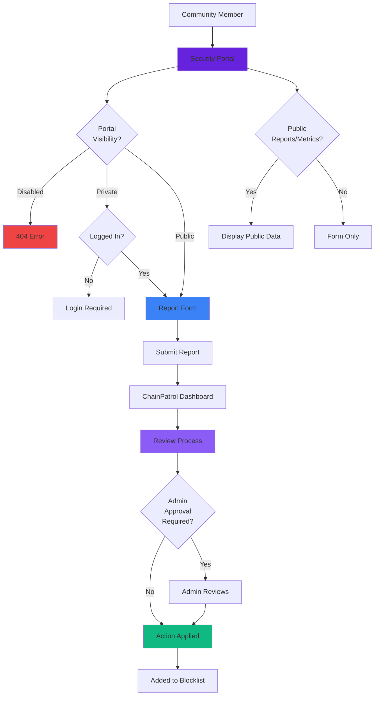

## What is the Security Portal?

The **Security Portal** is your organization's public-facing page where people outside your team can report suspicious activity directly to ChainPatrol.

<Info>
It's a branded landing page that shows your organization's name and gives anyone with the link an easy way to submit threats they've encountered, whether that's a phishing site, a fake social profile, or a malicious app pretending to be yours.
</Info>

### Transparency Features

When the Security Portal is enabled, it can also display:

<CardGroup cols={2}>
  <Card title="Public Reports" icon="flag">
    Show what threats have been reported and what action was taken
  </Card>
  
  <Card title="Public Metrics" icon="chart-line">
    Display high-level statistics about threats detected and addressed
  </Card>
</CardGroup>

<Check>
This gives your community and stakeholders transparency into how actively threats are being detected and addressed for your organization.
</Check>

## Who Uses It?

The Security Portal is designed for **your community**:

<Tabs>
  <Tab title="External Users" icon="users">
    **Community-powered threat reporting**
    
    <AccordionGroup>
      <Accordion title="Users and Customers" icon="user">
        People who use your products or services and encounter suspicious content
        
        **What they report:**
        - Phishing sites they've encountered
        - Fake social media accounts
        - Scam messages claiming to be from your brand
        - Suspicious apps or extensions
      </Accordion>
      
      <Accordion title="Community Members" icon="users">
        Discord moderators, Telegram admins, and active community participants
        
        **What they report:**
        - Impersonation in community channels
        - Scam posts targeting your community
        - Fake support accounts
        - Coordinated attack campaigns
      </Accordion>
      
      <Accordion title="Partners" icon="handshake">
        Business partners, affiliates, and ecosystem participants
        
        **What they report:**
        - Threats affecting shared users
        - Cross-brand impersonation
        - Supply chain threats
        - Industry-wide campaigns
      </Accordion>
      
      <Accordion title="Security Researchers" icon="user-shield">
        Independent researchers and white-hat hackers
        
        **What they report:**
        - Newly discovered threats
        - Sophisticated attack patterns
        - Zero-day phishing campaigns
        - Technical vulnerabilities
      </Accordion>
    </AccordionGroup>
    
    <Note>
    Instead of requiring them to have an account or go through complicated channels, they can simply visit your Security Portal and submit a report in a few clicks.
    </Note>
  </Tab>
  
  <Tab title="Internal Team" icon="user-tie">
    **Quick access for your team**
    
    You can also use it internally to give your team a quick, always-available way to report threats without logging into the full ChainPatrol dashboard.
    
    **Benefits:**
    - No login required
    - Faster submission for quick reports
    - Mobile-friendly interface
    - Bookmarkable URL
    - Share with non-technical team members
    
    **Use cases:**
    - Customer support spotting scams
    - Marketing team finding impersonation
    - Community managers reporting threats
    - Executives forwarding suspicious content
  </Tab>
</Tabs>

## Where Can You Find It?

Your Security Portal lives at a unique URL based on your organization's slug.

<Card title="URL Format" icon="link">
  **Example:** If your organization is `acme`, your Security Portal would be at:
  
  `chainpatrol.io/acme`
</Card>

### Locating Your Portal URL

<Steps>
  <Step title="Navigate to Settings">
    Go to **Settings → Security Portal** in your dashboard
  </Step>
  
  <Step title="Find the URL Card">
    Look for the "Security Portal URL" card
  </Step>
  
  <Step title="Copy and Share">
    Click the link to copy your unique URL and share it with your community
  </Step>
</Steps>

<Tip>
Add your Security Portal URL to your website footer, documentation, and community resources so users know where to report threats.
</Tip>

## Where Can You Configure It?

You configure the Security Portal in **Settings → Security Portal** within your organization's dashboard.

### Configuration Options

<Tabs>
  <Tab title="Visibility" icon="eye">
    **Controls who can access the portal**
    
    <CardGroup cols={3}>
      <Card title="Disabled" icon="circle-xmark" color="#ef4444">
        The portal isn't accessible to anyone
      </Card>
      
      <Card title="Private" icon="lock" color="#f59e0b">
        Only members of your organization can see it
      </Card>
      
      <Card title="Public" icon="globe" color="#10b981">
        Anyone with the link can access it
      </Card>
    </CardGroup>
    
    **When to use each:**
    
    <AccordionGroup>
      <Accordion title="Disabled" icon="circle-xmark">
        **Use when:**
        - Not ready to accept community reports
        - Testing other features first
        - Temporarily pausing public submissions
        
        **Effect:**
        - Portal returns 404 error
        - No one can submit reports via portal
        - URL is not accessible
      </Accordion>
      
      <Accordion title="Private" icon="lock">
        **Use when:**
        - Want internal-only reporting
        - Testing portal before public launch
        - Limiting to team members only
        
        **Effect:**
        - Requires ChainPatrol login
        - Only organization members can access
        - Good for internal testing
      </Accordion>
      
      <Accordion title="Public" icon="globe">
        **Use when:**
        - Ready for community reporting
        - Want to maximize threat detection
        - Building transparent security program
        
        **Effect:**
        - Anyone with URL can submit reports
        - No authentication required
        - Maximum community engagement
      </Accordion>
    </AccordionGroup>
  </Tab>
  
  <Tab title="Public Reports" icon="flag">
    **Display submitted reports publicly**
    
    <Card title="What It Does" icon="list">
      A toggle that determines whether non-authenticated users can view the reports submitted to your organization.
    </Card>
    
    **When enabled:**
    - People visiting your Security Portal can see what's been reported
    - Shows what action has been taken on each report
    - Demonstrates active threat monitoring
    - Builds community trust
    
    **What's displayed:**
    - Report title and description
    - Assets reported (URLs, accounts, etc.)
    - Status (pending, in progress, closed)
    - Date submitted
    - Action taken (blocked, allowed, etc.)
    
    **What's NOT displayed:**
    - Internal comments
    - Reviewer identities
    - Sensitive investigation details
    - Private organization information
    
    <Warning>
    Consider your transparency goals and privacy requirements before enabling public reports.
    </Warning>
  </Tab>
  
  <Tab title="Public Metrics" icon="chart-bar">
    **Display threat statistics publicly**
    
    <Card title="What It Does" icon="chart-line">
      A toggle that displays high-level threat statistics on your Security Portal.
    </Card>
    
    **Metrics displayed:**
    - Threats blocked
    - Takedowns filed
    - Takedowns completed
    - Reports received
    - Threats by asset type
    - Recent activity trends
    
    **Benefits:**
    
    <CardGroup cols={2}>
      <Card title="Transparency" icon="eye">
        Show stakeholders you're actively monitoring
      </Card>
      
      <Card title="Trust Building" icon="handshake">
        Demonstrate security commitment
      </Card>
      
      <Card title="Community Engagement" icon="users">
        Show impact of community reports
      </Card>
      
      <Card title="Deterrence" icon="shield">
        Signal to attackers that you're protected
      </Card>
    </CardGroup>
    
    <Check>
    Public metrics demonstrate that your organization takes security seriously without exposing sensitive details.
    </Check>
  </Tab>
</Tabs>

## Why Does It Exist?

The Security Portal serves two primary purposes:

<Tabs>
  <Tab title="Community-Powered Protection" icon="users">
    **Make it easy for your community to help protect your brand**
    
    ### The Problem
    
    When users encounter a phishing site or a fake profile impersonating you, they often want to report it but don't know how.
    
    **Common barriers:**
    - No clear reporting channel
    - Complicated submission process
    - Requires account creation
    - Unclear if reports are acted upon
    
    ### The Solution
    
    The Security Portal gives them a simple, trusted place to submit that information directly to ChainPatrol.
    
    **Benefits:**
    
    <CardGroup cols={2}>
      <Card title="Easy Submission" icon="paper-plane">
        Simple form, no account required
      </Card>
      
      <Card title="Clear Process" icon="list-check">
        Users know exactly what to report
      </Card>
      
      <Card title="Trusted Channel" icon="shield-check">
        Official, branded reporting page
      </Card>
      
      <Card title="Visible Impact" icon="chart-line">
        See that reports lead to action
      </Card>
    </CardGroup>
  </Tab>
  
  <Tab title="Transparency & Trust" icon="eye">
    **Demonstrate active security monitoring**
    
    By enabling public reports and metrics, you can show:
    
    <AccordionGroup>
      <Accordion title="Stakeholders" icon="briefcase">
        **Demonstrate security posture**
        
        - Board members see active threat monitoring
        - Investors understand security investment
        - Partners verify protection measures
        - Auditors review security processes
      </Accordion>
      
      <Accordion title="Regulators" icon="scale-balanced">
        **Compliance and due diligence**
        
        - Show proactive threat detection
        - Document response procedures
        - Demonstrate user protection
        - Evidence of security controls
      </Accordion>
      
      <Accordion title="User Base" icon="users">
        **Build community trust**
        
        - Users see you take security seriously
        - Community understands threat landscape
        - Transparency builds confidence
        - Encourages more reporting
      </Accordion>
    </AccordionGroup>
    
    <Check>
    This builds trust and demonstrates that your organization takes security seriously.
    </Check>
  </Tab>
</Tabs>

## Where Do Community Reports Go?

When someone submits a report through your Security Portal, it flows into your organization's **Reports** page in the ChainPatrol dashboard, just like any other report.

### Report Processing Flow

<Steps>
  <Step title="Submission">
    User submits report via Security Portal
  </Step>
  
  <Step title="Report Created">
    Report appears in your organization's Reports page
  </Step>
  
  <Step title="Review Process">
    ChainPatrol's team evaluates the evidence and runs security checks
  </Step>
  
  <Step title="Decision">
    Determines whether reported assets should be blocked, allowed, or escalated
  </Step>
  
  <Step title="Admin Approval (Optional)">
    If "Obligatory Organization Admin Approval" is enabled, your team confirms the action
  </Step>
  
  <Step title="Action Applied">
    Asset status is updated and distributed to blocklist
  </Step>
</Steps>

<Info>
From there, the report goes through the same review process as any other submission.
</Info>

## Security Portal Workflow

---

## Key Takeaways

<CardGroup cols={2}>
  <Card title="Public Reporting Page" icon="globe">
    Branded landing page for community threat reports
  </Card>
  
  <Card title="Easy Submission" icon="paper-plane">
    No account required for public portals
  </Card>
  
  <Card title="Three Visibility Levels" icon="eye">
    Disabled, Private, or Public access
  </Card>
  
  <Card title="Optional Transparency" icon="chart-line">
    Show public reports and metrics
  </Card>
  
  <Card title="Community-Powered" icon="users">
    Enables users to help protect your brand
  </Card>
  
  <Card title="Same Review Process" icon="clipboard-check">
    Reports flow through standard review workflow
  </Card>
  
  <Card title="Trust Building" icon="handshake">
    Demonstrates active security monitoring
  </Card>
  
  <Card title="Unique URL" icon="link">
    Based on your organization's slug
  </Card>
</CardGroup>

---

<Card
  title="Configure Your Security Portal"
  icon="gear"
  href="https://app.chainpatrol.io"
>
  Access Settings → Security Portal to enable and customize your public reporting page
</Card>
