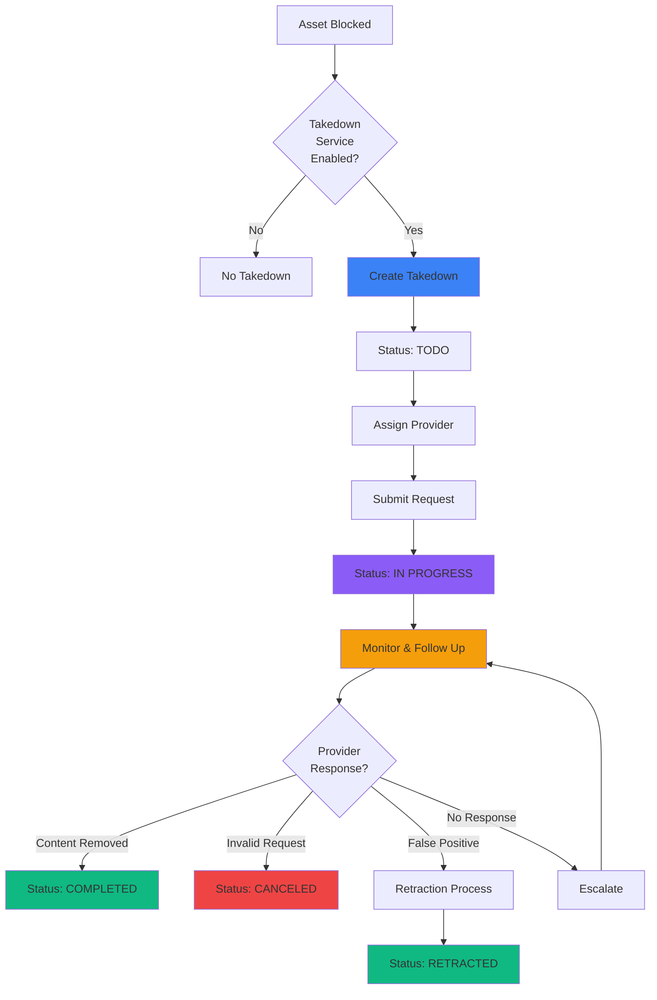

## What Is a Takedown?

A **takedown** is a formal request asking an online platform to remove harmful, fraudulent, or unauthorized content.

<Info>
This request is sent to the organization responsible for hosting or displaying that content, such as a hosting provider, domain registrar, social media platform, app store, or TLD registry.
</Info>

## Why Takedowns Matter

Takedowns are an essential tool for protecting brands and users online. They help remove content that:

<CardGroup cols={3}>
  <Card title="Impersonation" icon="user-secret">
    Impersonates legitimate organizations
  </Card>
  
  <Card title="Scams" icon="sack-dollar">
    Misleads or scams users
  </Card>
  
  <Card title="Trademark Abuse" icon="trademark">
    Abuses a brand's trademarks
  </Card>
  
  <Card title="Harmful Information" icon="triangle-exclamation">
    Spreads harmful information
  </Card>
  
  <Card title="Fraudulent Apps" icon="mobile">
    Distributes fraudulent or malicious applications
  </Card>
  
  <Card title="Phishing" icon="fishing-rod">
    Hosts phishing pages or fake login portals
  </Card>
</CardGroup>

## Where Takedowns Are Sent

Because digital threats appear across many parts of the internet, takedowns may be sent to a wide range of platforms:

<Tabs>
  <Tab title="Websites" icon="globe">
    **Web hosting and domain infrastructure**
    
    <AccordionGroup>
      <Accordion title="Hosting Providers" icon="server">
        Organizations that host website content
        
        **Examples:**
        - AWS, Cloudflare, Vercel
        - Shared hosting companies
        - VPS and dedicated server providers
        
        **Typical response time:** 4-48 hours
      </Accordion>
      
      <Accordion title="Domain Registrars" icon="globe">
        Companies that register and manage domain names
        
        **Examples:**
        - GoDaddy, Namecheap, Google Domains
        - Country-specific registrars
        - Reseller networks
        
        **Typical response time:** 24-72 hours
      </Accordion>
      
      <Accordion title="TLD Registries" icon="network-wired">
        Organizations managing top-level domains (.com, .xyz, etc.)
        
        **Examples:**
        - Verisign (.com, .net)
        - Public Interest Registry (.org)
        - Country-code registries
        
        **Typical response time:** Varies widely
      </Accordion>
    </AccordionGroup>
  </Tab>
  
  <Tab title="Social Media" icon="share-nodes">
    **Social platforms and communication channels**
    
    <CardGroup cols={2}>
      <Card title="Twitter/X" icon="x-twitter">
        Impersonation accounts, scam posts
      </Card>
      
      <Card title="Facebook" icon="facebook">
        Fake pages, scam groups
      </Card>
      
      <Card title="Instagram" icon="instagram">
        Impersonation profiles, fraudulent posts
      </Card>
      
      <Card title="YouTube" icon="youtube">
        Scam livestreams, fake giveaways
      </Card>
      
      <Card title="Telegram" icon="telegram">
        Fake support channels, scam groups
      </Card>
      
      <Card title="Discord" icon="discord">
        Phishing servers, impersonation bots
      </Card>
      
      <Card title="Reddit" icon="reddit">
        Scam subreddits, impersonation accounts
      </Card>
      
      <Card title="TikTok" icon="tiktok">
        Scam videos, impersonation accounts
      </Card>
    </CardGroup>
    
    **What gets removed:**
    - Impersonation accounts
    - Scam posts and messages
    - Fake support channels
    - Fraudulent giveaways
  </Tab>
  
  <Tab title="App Stores" icon="mobile">
    **Mobile and browser application marketplaces**
    
    <CardGroup cols={3}>
      <Card title="Google Play" icon="google-play">
        Android applications
      </Card>
      
      <Card title="Apple App Store" icon="app-store-ios">
        iOS applications
      </Card>
      
      <Card title="Chrome Web Store" icon="chrome">
        Browser extensions
      </Card>
      
      <Card title="Firefox Add-ons" icon="firefox">
        Firefox extensions
      </Card>
      
      <Card title="Microsoft Store" icon="microsoft">
        Windows applications
      </Card>
    </CardGroup>
    
    **What gets removed:**
    - Fake wallet applications
    - Malicious browser extensions
    - Impersonation apps
    - Fraudulent utilities
  </Tab>
  
  <Tab title="Decentralized Platforms" icon="network-wired">
    **Distributed and blockchain-based hosting**
    
    <Card title="IPFS" icon="database">
      **InterPlanetary File System**
      
      Harmful content can be stored in a distributed way across IPFS nodes.
      
      **Takedown targets:**
      - IPFS gateway operators
      - Pinning services
      - Node operators hosting malicious content
      
      **Challenges:**
      - Decentralized nature makes complete removal difficult
      - Content may persist on some nodes
      - Gateway blocking is most effective approach
    </Card>
    
    <Note>
    Decentralized platforms require different takedown strategies, often focusing on gateway access rather than complete content removal.
    </Note>
  </Tab>
</Tabs>

## The Purpose of Takedowns

Regardless of the platform, the purpose of a takedown is the same:

<Card title="Core Objective" icon="bullseye">
  **To remove dangerous or unauthorized content quickly, securely, and effectively.**
</Card>

### Takedowns vs. Blocklisting

<Tabs>
  <Tab title="Takedowns" icon="power-off">
    **Complete removal from the internet**
    
    **Advantages:**
    - Content is permanently removed
    - Attackers lose their infrastructure
    - Prevents future victims from accessing
    - Demonstrates enforcement action
    
    **Disadvantages:**
    - Takes time (hours to days)
    - Some providers don't respond
    - Attackers can quickly create new sites
    - Jurisdiction and legal challenges
    
    **Best for:**
    - Long-term threat elimination
    - Persistent campaigns
    - High-profile impersonation
  </Tab>
  
  <Tab title="Blocklisting" icon="shield">
    **Immediate protection at point of access**
    
    **Advantages:**
    - Instant protection (15-30 minutes)
    - Works regardless of hosting provider
    - Protects even if content stays online
    - Universal coverage across platforms
    
    **Disadvantages:**
    - Content remains online
    - Requires integration with security tools
    - May not prevent all access methods
    
    **Best for:**
    - Immediate threat mitigation
    - Rapid response scenarios
    - Protecting users before takedown completes
  </Tab>
</Tabs>

<Check>
**ChainPatrol's approach:** "Blocklist-first, takedown-second" provides immediate protection while working toward permanent removal.
</Check>

## Takedown Lifecycle

<Steps>
  <Step title="TODO">
    Takedown has been created and is waiting to be processed
  </Step>
  
  <Step title="IN PROGRESS">
    ChainPatrol is actively working on the takedown:
    - Submitting to appropriate provider
    - Monitoring the request
    - Following up as needed
  </Step>
  
  <Step title="COMPLETED">
    The provider removed the harmful content
  </Step>
</Steps>

### Alternative Outcomes

<CardGroup cols={2}>
  <Card title="CANCELED" icon="circle-xmark" color="#ef4444">
    Takedown stopped (e.g., content invalid or unnecessary)
  </Card>
  
  <Card title="PENDING RETRACTION" icon="clock" color="#f59e0b">
    Identified as false positive, marked for retraction
  </Card>
  
  <Card title="RETRACTION SENT" icon="paper-plane" color="#8b5cf6">
    Formal retraction request submitted to provider
  </Card>
  
  <Card title="RETRACTED" icon="rotate-left" color="#10b981">
    Provider confirmed retraction—takedown reversed
  </Card>
</CardGroup>

## What Makes Takedowns Effective

<AccordionGroup>
  <Accordion title="Legal Documentation" icon="scale-balanced">
    **Proper authorization and evidence**
    
    Effective takedowns require:
    - Power of Attorney (POA) authorizing action
    - Trademark registration documents
    - Clear evidence of abuse or impersonation
    - Authorized representative details
    
    <Tip>
    ChainPatrol handles all legal documentation and submission on your behalf.
    </Tip>
  </Accordion>
  
  <Accordion title="Provider Relationships" icon="handshake">
    **Established communication channels**
    
    We maintain relationships with 100+ providers:
    - Known abuse contact information
    - Established reporting procedures
    - Track record of successful takedowns
    - Understanding of each provider's requirements
  </Accordion>
  
  <Accordion title="Persistent Follow-Up" icon="arrows-rotate">
    **Continuous monitoring and escalation**
    
    We don't just submit and forget:
    - Regular status checks
    - Follow-up communications
    - Escalation when needed
    - Alternative approaches if initial request fails
  </Accordion>
  
  <Accordion title="Evidence Collection" icon="camera">
    **Comprehensive documentation**
    
    Each takedown includes:
    - Screenshots of malicious content
    - Technical metadata (hosting, DNS, etc.)
    - Timeline of activity
    - User reports and impact evidence
  </Accordion>
</AccordionGroup>

## Takedown Workflow

---

## Key Takeaways

<CardGroup cols={2}>
  <Card title="Formal Removal Request" icon="file-lines">
    Takedowns are official requests to remove content
  </Card>
  
  <Card title="Multiple Platforms" icon="layer-group">
    Sent to hosting, social media, app stores, and more
  </Card>
  
  <Card title="Brand Protection" icon="shield">
    Removes impersonation, scams, and trademark abuse
  </Card>
  
  <Card title="Lifecycle Tracking" icon="timeline">
    From TODO to COMPLETED with full visibility
  </Card>
  
  <Card title="Complement to Blocklisting" icon="arrows-split-up-and-left">
    Works alongside blocklists for comprehensive protection
  </Card>
  
  <Card title="Legal Documentation" icon="scale-balanced">
    Requires proper authorization and evidence
  </Card>
  
  <Card title="Provider Relationships" icon="handshake">
    Established channels with 100+ providers
  </Card>
  
  <Card title="Persistent Follow-Up" icon="arrows-rotate">
    Continuous monitoring until completion
  </Card>
</CardGroup>

---

<Card
  title="View Your Takedowns"
  icon="list-check"
  href="https://app.chainpatrol.io"
>
  Access your dashboard to monitor active and completed takedown requests
</Card>
