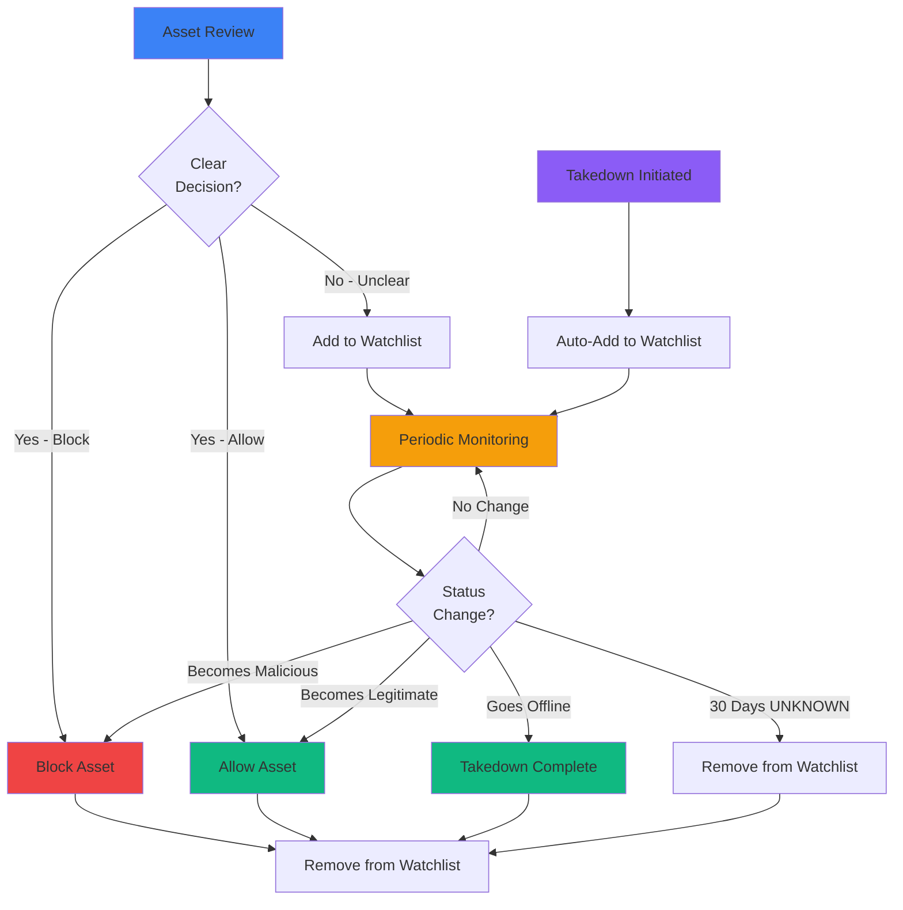

## What is the Watchlist?

The watchlist is a set of assets that we monitor to see if we can action on them further in the future.

<Info>
Think of the watchlist as a "middle ground" between blocking and allowing—assets that need continued observation before a final decision can be made.
</Info>

## Why Would We Need to Watchlist Something?

Assets are added to the watchlist for two primary reasons:

<Tabs>
  <Tab title="Inconclusive Evidence" icon="question">
    **When we can't make a clear determination**
    
    Sometimes when we process an asset to see if it's malicious, we don't find enough red flags to block the asset, but we also don't find enough green flags to allow the asset.
    
    ### The Gray Area
    
    <CardGroup cols={2}>
      <Card title="Not Enough to Block" icon="shield-xmark">
        - Insufficient evidence of malicious intent
        - Weak or ambiguous threat indicators
        - Could be legitimate but suspicious
      </Card>
      
      <Card title="Not Enough to Allow" icon="shield-check">
        - Asset isn't clearly official or trusted
        - Some concerning patterns detected
        - Uncertainty about legitimacy
      </Card>
    </CardGroup>
    
    ### What We Do
    
    In this situation, if we suspect that the asset may become malicious in the future, we keep tabs on the asset to see if it changes.
    
    **We can act and remove the asset from the watchlist when:**
    
    <Steps>
      <Step title="Becomes Clearly Malicious">
        Asset starts showing definitive malicious behavior or content
      </Step>
      
      <Step title="Becomes Clearly Legitimate">
        Asset is confirmed as official or safe
      </Step>
      
      <Step title="Changes Status">
        Asset goes offline, gets suspended, or undergoes significant changes
      </Step>
    </Steps>
    
    ### Common Scenarios
    
    <AccordionGroup>
      <Accordion title="Parking Page" icon="parking">
        **Scenario:** Domain is registered but shows only a parking page
        
        **Why watchlist:**
        - Domain name is suspicious (contains brand name + "airdrop")
        - No active content to analyze yet
        - May become malicious when content is added
        
        **What we monitor:**
        - When content appears
        - What type of content is added
        - Whether it becomes a phishing site
      </Accordion>
      
      <Accordion title="Dead Asset" icon="skull">
        **Scenario:** Website or profile is currently offline
        
        **Why watchlist:**
        - URL structure suggests brand impersonation
        - Can't analyze content that doesn't exist
        - May come online with malicious content
        
        **What we monitor:**
        - When it comes back online
        - What content appears
        - Whether it impersonates your brand
      </Accordion>
      
      <Accordion title="Ambiguous Content" icon="circle-question">
        **Scenario:** Asset has some concerning elements but unclear intent
        
        **Why watchlist:**
        - Uses brand-related keywords but purpose is unclear
        - Design has some similarities but not exact copy
        - Could be legitimate or could be preparing for scam
        
        **What we monitor:**
        - Content changes over time
        - Addition of phishing forms or wallet drainers
        - Clarification of intent
      </Accordion>
    </AccordionGroup>
  </Tab>
  
  <Tab title="Monitoring for Takedowns" icon="power-off">
    **Tracking takedown progress**
    
    When we start the takedown process, we want to make sure that we keep tabs on the asset in order to determine when the takedown has been completed.
    
    ### Automatic Watchlisting
    
    <Info>
    We place every asset onto the watchlist when the takedown is in progress.
    </Info>
    
    **Why this matters:**
    
    <CardGroup cols={2}>
      <Card title="Automated Monitoring" icon="robot">
        Continuous scanning to detect when asset goes offline
      </Card>
      
      <Card title="Completion Detection" icon="circle-check">
        Automatically mark takedown as complete when asset is inaccessible
      </Card>
      
      <Card title="Resource Efficiency" icon="gauge">
        No manual checking required for takedown status
      </Card>
      
      <Card title="Faster Response" icon="bolt">
        Immediate notification when takedown succeeds
      </Card>
    </CardGroup>
    
    ### The Takedown Monitoring Flow
    
    <Steps>
      <Step title="Takedown Initiated">
        Takedown request submitted to hosting provider or platform
      </Step>
      
      <Step title="Asset Watchlisted">
        Asset automatically added to watchlist for monitoring
      </Step>
      
      <Step title="Regular Scanning">
        Asset is scanned periodically to check liveness status
      </Step>
      
      <Step title="Status Change Detected">
        Asset goes offline, gets suspended, or becomes inaccessible
      </Step>
      
      <Step title="Takedown Confirmed">
        Takedown marked as complete, asset removed from watchlist
      </Step>
    </Steps>
    
    ### What We Monitor
    
    <AccordionGroup>
      <Accordion title="Liveness Status" icon="heartbeat">
        - Is the asset still accessible?
        - HTTP status codes (404, 403, etc.)
        - DNS resolution failures
        - Server responses
      </Accordion>
      
      <Accordion title="Provider Actions" icon="server">
        - "Suspended by provider" messages
        - Account termination notices
        - Content removal confirmations
        - Domain suspension indicators
      </Accordion>
      
      <Accordion title="Content Changes" icon="file-lines">
        - Malicious content removed
        - Page replaced with error message
        - Redirect to different content
        - Complete site removal
      </Accordion>
    </AccordionGroup>
    
    <Check>
    This allows us to monitor the asset and see if it goes offline, at which point we can take the asset off of the watchlist.
    </Check>
  </Tab>
</Tabs>

## Who Would Watchlist Something?

Watchlisting can be done either manually or automatically:

<Tabs>
  <Tab title="Manual Watchlisting" icon="user">
    **By analysts during review**
    
    <Card title="Review Process" icon="clipboard-check">
      When an analyst reviews a reported asset and encounters inconclusive evidence, they can manually add it to the watchlist.
    </Card>
    
    **Decision factors:**
    - Threat indicators present but not conclusive
    - Asset appears suspicious but needs more time to develop
    - Waiting for asset to become accessible
    - Need to observe behavior over time
    
    **Who can do this:**
    - ChainPatrol security analysts
    - Customer administrators (for their organization)
    - Trusted reviewers
  </Tab>
  
  <Tab title="Automatic Watchlisting" icon="robot">
    **During takedown process**
    
    <Card title="Takedown Automation" icon="bolt">
      Every asset is automatically added to the watchlist when a takedown is initiated.
    </Card>
    
    **Triggers:**
    - Takedown request submitted
    - Takedown status changes to "IN_PROGRESS"
    - Asset needs monitoring for completion
    
    **No manual intervention required:**
    - System automatically adds to watchlist
    - Monitoring begins immediately
    - Removal happens automatically when offline
  </Tab>
</Tabs>

## How the Watchlist Works

### Monitoring Frequency

Assets on the watchlist are scanned at different frequencies based on how long they've been monitored and their current status:

<Tabs>
  <Tab title="UNKNOWN/ALLOWED Assets" icon="question">
    **More frequent monitoring for uncertain assets**
    
    | Time on Watchlist | Scan Frequency |
    |-------------------|----------------|
    | < 6 hours | Hourly |
    | < 24 hours | Every 2 hours |
    | < 2 days | Every 4 hours |
    | < 7 days | Every 6 hours |
    | < 2 weeks | Every 12 hours |
    | < 1 month | Daily |
    | < 2 months | Every 2 days |
    | > 2 months | Every 4 days |
    
    <Note>
    Frequent early scans catch rapid changes; frequency decreases if asset remains stable.
    </Note>
  </Tab>
  
  <Tab title="BLOCKED Assets" icon="ban">
    **Less frequent monitoring for blocked assets**
    
    | Time on Watchlist | Scan Frequency |
    |-------------------|----------------|
    | < 6 hours | Every 3 hours |
    | < 24 hours | Every 6 hours |
    | < 2 days | Every 12 hours |
    | < 7 days | Every 18 hours |
    | < 2 weeks | Every 36 hours |
    | < 1 month | Every 3 days |
    | < 2 months | Every 6 days |
    | > 2 months | Every 12 days |
    
    <Note>
    Blocked assets are already protected, so monitoring focuses on confirming takedown success.
    </Note>
  </Tab>
</Tabs>

### Removal from Watchlist

Assets are automatically removed from the watchlist when:

<CardGroup cols={3}>
  <Card title="Status Changes to ALLOWED" icon="circle-check">
    Asset confirmed as legitimate
  </Card>
  
  <Card title="Asset Comes Online" icon="signal">
    Dead asset becomes accessible (pushed to review queue)
  </Card>
  
  <Card title="30 Days in UNKNOWN" icon="calendar">
    Decay factor removes long-term uncertain assets
  </Card>
  
  <Card title="Takedown Success" icon="power-off">
    Asset goes offline during takedown
  </Card>
  
  <Card title="Provider Suspension" icon="ban">
    Hosting provider suspends the asset
  </Card>
  
  <Card title="Manual Removal" icon="user">
    Analyst decides monitoring is no longer needed
  </Card>
</CardGroup>

## Watchlist Workflow

---

## Key Takeaways

<CardGroup cols={2}>
  <Card title="Middle Ground" icon="scale-balanced">
    Watchlist is for assets between blocking and allowing
  </Card>
  
  <Card title="Two Main Purposes" icon="arrows-split-up-and-left">
    Inconclusive evidence and takedown monitoring
  </Card>
  
  <Card title="Adaptive Monitoring" icon="gauge">
    Scan frequency adjusts based on time and status
  </Card>
  
  <Card title="Automatic for Takedowns" icon="robot">
    All takedown assets are automatically watchlisted
  </Card>
  
  <Card title="Manual for Review" icon="user">
    Analysts can watchlist during inconclusive reviews
  </Card>
  
  <Card title="Multiple Exit Paths" icon="door-open">
    Assets leave watchlist when status becomes clear
  </Card>
  
  <Card title="Time-Based Decay" icon="clock">
    Long-term uncertain assets are eventually removed
  </Card>
  
  <Card title="Continuous Scanning" icon="arrows-rotate">
    Regular checks detect changes and completion
  </Card>
</CardGroup>

---

<Card
  title="View Your Watchlist"
  icon="list"
  href="https://app.chainpatrol.io"
>
  Access your dashboard to see assets currently on your watchlist
</Card>
