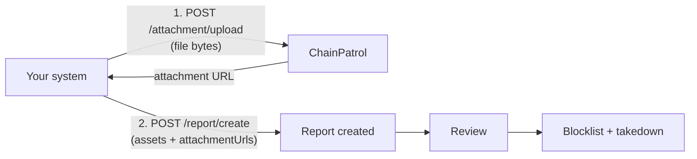

## Overview

A report is how you tell ChainPatrol about a threat. Each report bundles one or more
**assets** — the URLs, domains, social handles, or blockchain addresses you want acted on —
with the **context** and **evidence** our review team needs to act.

Everything goes through [`POST /report/create`](/external-api/report-create). Evidence files
are the one thing that needs a separate call first: files are uploaded to
[`POST /attachment/upload`](/external-api/attachment-upload), which returns URLs you then
pass to `report.create`.



<Info>
  **Attachments are optional.** If you have no files to send, skip step 2 entirely and call
  `report.create` on its own. And if you already host your evidence somewhere publicly
  reachable, put those URLs straight into `attachmentUrls` — the upload endpoint exists so
  that you do not have to host them.
</Info>

## Before you start

You need:

- **An API key**, sent as `X-API-KEY` on every request. See
  [Authentication](/external-api/authentication).
- **Your organization slug** — the identifier in your dashboard URL
  (`https://app.chainpatrol.io/<slug>`). If your key is scoped to a single organization you
  can omit `organizationSlug` and we will use the key's organization.

All endpoints are served from `https://app.chainpatrol.io/api/v2`.

## The flow

<Steps>
  <Step title="Check for an existing report (optional)">
    If your pipeline can rediscover the same threat, check first with
    [`POST /reports/search`](/external-api/reports-search). Re-reporting an asset that
    already has a pending report fails with a `422` and a `REPORT_ALREADY_EXISTS` error, so
    searching first keeps your error rate meaningful.

    ```bash
    curl -X POST 'https://app.chainpatrol.io/api/v2/reports/search' \
      -H 'X-API-KEY: YOUR_API_KEY_HERE' \
      -H 'Content-Type: application/json' \
      -d '{"slug": "acme", "assetContents": ["https://acme-airdrop.example"]}'
    ```
  </Step>

  <Step title="Upload your evidence files">
    Send each file to [`POST /attachment/upload`](/external-api/attachment-upload) and keep
    the URLs it returns. `.eml` message files, screenshots, PDFs, and more are supported —
    see [supported file types](/external-api/attachment-upload#supported-file-types).

    ```bash
    curl -X POST 'https://app.chainpatrol.io/api/v2/attachment/upload?fileName=phishing-email.eml' \
      -H 'X-API-KEY: YOUR_API_KEY_HERE' \
      --data-binary '@phishing-email.eml'
    ```

    ```json Response
    {
      "attachments": [
        {
          "url": "https://upcdn.io/ACCOUNT/raw/uploads/2026/09/03/api-attachments/org-42/8f14e45f-ea3a-4f0b-9b1a-1c2d3e4f5a6b/phishing-email.eml",
          "fileName": "phishing-email.eml",
          "sizeBytes": 48210
        }
      ]
    }
    ```

    Nothing is attached to a report yet — the upload only stores the file and hands you a
    URL. Multipart lets you send up to 10 files in one request; the 4 MB limit applies to
    the whole request body.
  </Step>

  <Step title="Create the report">
    Call [`POST /report/create`](/external-api/report-create) with your assets and the
    attachment URLs from the previous step.

    ```bash
    curl -X POST 'https://app.chainpatrol.io/api/v2/report/create' \
      -H 'X-API-KEY: YOUR_API_KEY_HERE' \
      -H 'Content-Type: application/json' \
      -d '{
        "organizationSlug": "acme",
        "title": "Acme airdrop phishing email",
        "description": "Customer forwarded a phishing email impersonating Acme support. Raw message attached.",
        "contactInfo": "security@acme.example",
        "attachmentUrls": [
          "https://upcdn.io/ACCOUNT/raw/uploads/2026/09/03/api-attachments/org-42/8f14e45f-ea3a-4f0b-9b1a-1c2d3e4f5a6b/phishing-email.eml"
        ],
        "assets": [
          { "content": "https://acme-airdrop.example/claim", "status": "BLOCKED" },
          { "content": "@acme_support_help", "status": "BLOCKED" }
        ]
      }'
    ```

    ```json Response
    {
      "id": 1679208,
      "createdAt": "2026-09-03T23:21:46.450Z",
      "organization": {
        "id": 42,
        "slug": "acme",
        "name": "Acme"
      }
    }
    ```

    Keep the `id` — it is how the report is identified in the dashboard and in
    [`GET /organization/reports`](/external-api/organization-reports-list).
  </Step>

  <Step title="Track what happens next">
    The report goes to review. Images you attached appear inline on the report; other files
    are listed as downloadable evidence, and our takedown team can forward them to the
    registrar or hosting provider — which is why a raw `.eml` is worth more than a
    screenshot of one.

    Poll [`GET /organization/reports`](/external-api/organization-reports-list) for status,
    or [configure a webhook](/external-api/webhook-config) to be notified when asset
    statuses change instead of polling.
  </Step>
</Steps>

## Complete example

Upload and report in one script: two files go up in a single multipart request, and both
URLs are attached to one report.

<CodeGroup>

```typescript TypeScript
import { readFile } from "node:fs/promises";

const API_KEY = process.env.CHAINPATROL_API_KEY!;
const BASE_URL = "https://app.chainpatrol.io/api/v2";

async function uploadAttachments(paths: string[]): Promise<string[]> {
  const form = new FormData();

  for (const path of paths) {
    const bytes = await readFile(path);
    const fileName = path.split("/").pop()!;
    form.append("file", new File([bytes], fileName));
  }

  const response = await fetch(`${BASE_URL}/attachment/upload`, {
    method: "POST",
    headers: { "X-API-KEY": API_KEY },
    body: form,
  });

  if (!response.ok) {
    throw new Error(`Upload failed (${response.status}): ${await response.text()}`);
  }

  const { attachments } = await response.json();
  return attachments.map((attachment: { url: string }) => attachment.url);
}

async function createReport(attachmentUrls: string[]) {
  const response = await fetch(`${BASE_URL}/report/create`, {
    method: "POST",
    headers: {
      "Content-Type": "application/json",
      "X-API-KEY": API_KEY,
    },
    body: JSON.stringify({
      organizationSlug: "acme",
      title: "Acme airdrop phishing email",
      description: "Customer forwarded a phishing email impersonating Acme support.",
      contactInfo: "security@acme.example",
      attachmentUrls,
      assets: [{ content: "https://acme-airdrop.example/claim", status: "BLOCKED" }],
    }),
  });

  if (!response.ok) {
    // 422 responses carry per-asset details in data.errors
    throw new Error(`Report failed (${response.status}): ${await response.text()}`);
  }

  return response.json();
}

const urls = await uploadAttachments([
  "./phishing-email.eml",
  "./screenshot.png",
]);
const report = await createReport(urls);
console.log(`Created report ${report.id}`);
```

```python Python
import os
import requests

API_KEY = os.environ["CHAINPATROL_API_KEY"]
BASE_URL = "https://app.chainpatrol.io/api/v2"
HEADERS = {"X-API-KEY": API_KEY}


def upload_attachments(paths):
    files = [("file", (path.split("/")[-1], open(path, "rb"))) for path in paths]

    response = requests.post(
        f"{BASE_URL}/attachment/upload", headers=HEADERS, files=files
    )
    response.raise_for_status()

    return [attachment["url"] for attachment in response.json()["attachments"]]


def create_report(attachment_urls):
    response = requests.post(
        f"{BASE_URL}/report/create",
        headers=HEADERS,
        json={
            "organizationSlug": "acme",
            "title": "Acme airdrop phishing email",
            "description": "Customer forwarded a phishing email impersonating Acme support.",
            "contactInfo": "security@acme.example",
            "attachmentUrls": attachment_urls,
            "assets": [
                {"content": "https://acme-airdrop.example/claim", "status": "BLOCKED"}
            ],
        },
    )
    response.raise_for_status()

    return response.json()


urls = upload_attachments(["./phishing-email.eml", "./screenshot.png"])
report = create_report(urls)
print(f"Created report {report['id']}")
```

```bash cURL
# 1. upload both files in one multipart request
curl -X POST 'https://app.chainpatrol.io/api/v2/attachment/upload' \
  -H "X-API-KEY: $CHAINPATROL_API_KEY" \
  -F 'file=@phishing-email.eml' \
  -F 'file=@screenshot.png'

# 2. attach the returned URLs to a report
curl -X POST 'https://app.chainpatrol.io/api/v2/report/create' \
  -H "X-API-KEY: $CHAINPATROL_API_KEY" \
  -H 'Content-Type: application/json' \
  -d '{
    "organizationSlug": "acme",
    "title": "Acme airdrop phishing email",
    "description": "Customer forwarded a phishing email impersonating Acme support.",
    "attachmentUrls": [
      "https://upcdn.io/ACCOUNT/raw/uploads/.../phishing-email.eml",
      "https://upcdn.io/ACCOUNT/raw/uploads/.../screenshot.png"
    ],
    "assets": [
      { "content": "https://acme-airdrop.example/claim", "status": "BLOCKED" }
    ]
  }'
```

</CodeGroup>

## Report fields

The fields you will use most. The full schema, including every optional field, is on the
[Create Report](/external-api/report-create) reference page.

| Field                    | Type   | Required | Description                                                                                                                     |
| ------------------------ | ------ | -------- | ------------------------------------------------------------------------------------------------------------------------------- |
| `assets`                 | array  | Yes      | The assets being reported. At least one.                                                                                        |
| `assets[].content`       | string | Yes      | The URL, domain, social handle, or blockchain address. Phone numbers need a country code in E.164 format (`+14155552671`).       |
| `assets[].status`        | string | No       | Status you are proposing: `BLOCKED` (default), `ALLOWED`, or `UNKNOWN`.                                                         |
| `assets[].brandSlug`     | string | No       | Which of your brands the asset impersonates. Reviewers can override it.                                                         |
| `organizationSlug`       | string | No       | Organization to file under. Defaults to your API key's organization when the key is scoped to one.                              |
| `title`                  | string | No       | Short summary. Minimum 3 characters.                                                                                            |
| `description`            | string | No       | The details reviewers act on. Supports Markdown.                                                                                |
| `contactInfo`            | string | No       | How to reach the reporter, if we need to follow up.                                                                              |
| `attachmentUrls`         | array  | No       | URLs of evidence files — from [Upload Attachment](/external-api/attachment-upload), or your own publicly reachable links.        |
| `externalSubmissionLink` | string | No       | Link back to where the report came from, such as a Telegram message or a support ticket.                                        |

<Note>
  `organizationSlug`, `discordGuildId`, and `telegramGroupId` are three ways to name the
  same thing. Use `organizationSlug` unless you are building a Discord or Telegram
  integration and only have the platform's ID to hand.
</Note>

## Attachments in more detail

- **Any file type on the supported list, not just images.** The upload endpoint accepts
  `.eml` and `.msg` messages, PDFs, Word documents, CSVs, plain text, and the common image
  formats.
- **Images are displayed, other files are listed.** We classify by extension: image
  extensions render inline on the report, everything else appears as a downloadable file.
- **Non-image files can go out with the takedown.** Our team can attach them to the email
  sent to a registrar or hosting provider, using the file name you uploaded — so name
  files descriptively.
- **Self-hosted URLs still work.** Anything in `attachmentUrls` is stored as given. If you
  host evidence yourself, keep those links alive; we cannot re-fetch a link that has
  expired.
- **Attach files to the report that they are evidence for.** Attachments belong to the
  report as a whole, not to an individual asset, so if two threats are unrelated, file two
  reports.

## Handling errors

`report.create` returns `422 Unprocessable Content` when the request is well-formed but the
assets cannot be reported — the most common outcome to code against. The response carries
one entry per failing asset in `data.errors`, each with an `errorType`, a `message`, and a
`suggestion`:

```json
{
  "message": "Report creation failed: 1 of 2 assets already has a pending report. You can find and escalate existing reports in your ChainPatrol dashboard.",
  "code": "UNPROCESSABLE_CONTENT",
  "data": {
    "errors": [
      {
        "asset": "https://acme-airdrop.example/claim",
        "errorType": "REPORT_ALREADY_EXISTS",
        "message": "A report for this asset is already being processed",
        "suggestion": "Find the existing report in your ChainPatrol dashboard under Reports and escalate it there if needed"
      }
    ]
  }
}
```

All assets must be valid for the report to be created — a `422` means no report was
created. Fix or drop the offending assets and resubmit. Every `errorType` is listed on the
[Create Report](/external-api/report-create) reference page.

For upload failures, see
[error responses](/external-api/attachment-upload#error-responses) on the Upload Attachment
page.

## Best practices

- **One report per threat, several assets per report.** If a phishing campaign spans a
  site, a Twitter handle, and a wallet address, put all three in one report — the shared
  context is what makes them reviewable together.
- **Search before you submit** if your pipeline can rediscover the same asset.
- **Send raw `.eml` when you have it.** The headers are what email providers and registrars
  act on; a screenshot of an email is much weaker evidence.
- **Include a description a human can act on.** What was the lure, where was it seen, who
  reported it.
- **Set `brandSlug`** when you know which brand is being impersonated — it saves a review
  step. Fetch valid slugs from
  [List Organization Brands](/external-api/organization-brands).
- **Do not retry a `422` unchanged.** It is a validation outcome, not a transient failure.
  Retry `5xx` with exponential backoff.

## Other ways to create reports

<CardGroup cols={2}>
  <Card title="CLI" icon="terminal" href="/cli/commands/reports">
    `chainpatrol reports create` files a report from the terminal, including
    `--attachment-url` for evidence you have already uploaded.
  </Card>

  <Card title="Dashboard" icon="browser" href="https://app.chainpatrol.io">
    Your team can create reports by hand and drag evidence files straight onto them.
  </Card>

  <Card title="Security Portal" icon="shield" href="/concepts/security-portal">
    A public submission form for your community, with no login required.
  </Card>

  <Card title="Bots" icon="robot" href="/bots/discord-bot">
    Discord, Telegram, and Slack bots let your community report from where they already are.
  </Card>
</CardGroup>

<Note>
  The CLI and the JavaScript SDK take attachment **URLs**, not files. To upload a file
  today, call [`POST /attachment/upload`](/external-api/attachment-upload) directly and pass
  the URL it returns.
</Note>
