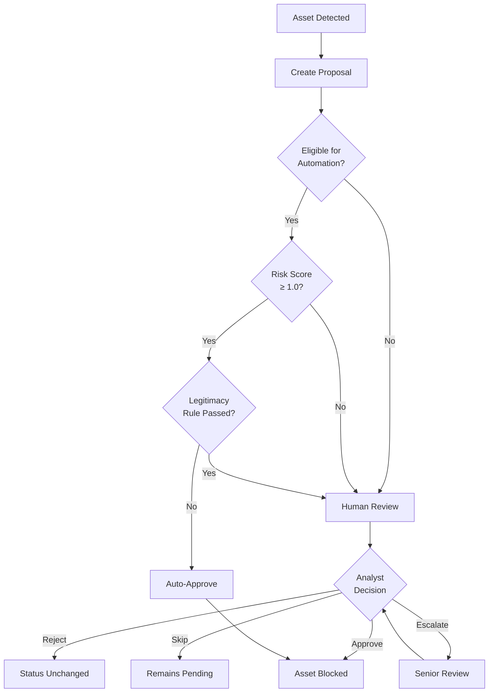

## Overview

In order to block malicious threats or allow official assets, we use the Review process. To change an Asset's status (from `UNKNOWN` to `BLOCKED`/`ALLOWED`, or in special cases between `BLOCKED` and `ALLOWED`), we create a **Proposal**.

<Info>
Each Proposal is evaluated by either human reviewers or our automation, who can make one of four decisions: **Approve**, **Reject**, **Skip**, or **Escalate**.
</Info>

### Proposal Decisions

<CardGroup cols={2}>
  <Card title="Approve" icon="circle-check" color="#10b981">
    Accepts the Asset's status change and closes the Proposal
  </Card>
  
  <Card title="Reject" icon="circle-xmark" color="#ef4444">
    Denies the status change and closes the Proposal
  </Card>
  
  <Card title="Skip" icon="forward" color="#f59e0b">
    Keeps Proposal pending when there's insufficient evidence
  </Card>
  
  <Card title="Escalate" icon="arrow-up" color="#8b5cf6">
    Sends to senior team members or customer for additional review
  </Card>
</CardGroup>

<Note>
Only **Approve** and **Reject** decisions close out the Proposal. **Skip** and **Escalate** keep the Proposal in `PENDING` status for further evaluation.
</Note>

## Automation

Our automated review system handles high-confidence threat detections, allowing human analysts to focus on edge cases and complex decisions.

### When Do We Perform Automated Review?

Automated review is enabled when specific conditions are met:

<AccordionGroup>
  <Accordion title="Organization Requirements" icon="building">
    Reviewing automation only activates for organizations with an active subscription status:
    - **Active** - Fully subscribed organization
    - **Trial** - Organization in trial period
    - **Prospect** - Prospective customer with evaluation access
  </Accordion>
  
  <Accordion title="Asset Information Requirements" icon="database">
    Automation requires sufficient data about the Asset. Some platforms currently lack adequate information gathering capabilities:
    
    **Platforms requiring human review:**
    - Facebook
    - Instagram
    - TikTok
    
    These asset types always require manual evaluation due to limited automated data collection.
  </Accordion>
  
  <Accordion title="Proposal Type Restrictions" icon="ban">
    Automated review **only** handles Proposals to set an Asset to `BLOCKED` status.
    
    **Not automated:**
    - Proposals to set Assets to `ALLOWED` status
    - Proposals to set Assets to `UNKNOWN` status
  </Accordion>
</AccordionGroup>

### How Does Automated Review Make a Decision?

Our automated review system calculates a **risk score** to determine whether an asset should be approved as malicious.

<Steps>
  <Step title="Rule Execution">
    During an Asset Scan, multiple detection rules are executed against the asset
  </Step>
  
  <Step title="Score Calculation">
    The risk score is a weighted sum of all individual scores from each successful rule execution
  </Step>
  
  <Step title="Threshold Evaluation">
    The final risk score is compared against our approval threshold (1.0)
  </Step>
  
  <Step title="Decision">
    Assets meeting the threshold are automatically approved; others are escalated
  </Step>
</Steps>

#### Risk Score Example

<Tabs>
  <Tab title="High Risk (Auto-Approved)" icon="circle-check">
    **Scenario:** Asset has 10 rules executed
    - 6 rules contribute a score of 0.2 each = 1.2 total
    - 4 rules contribute a score of 0.1 each = 0.4 total
    - **Total Risk Score: 1.6**
    
    ✅ Since 1.6 ≥ 1.0, the Proposal is **automatically approved**
  </Tab>
  
  <Tab title="Medium Risk (Escalated)" icon="arrow-up">
    **Scenario:** Asset has 10 rules executed
    - 4 rules contribute a score of 0.1 each = 0.4 total
    - 2 rules contribute a score of 0.2 each = 0.4 total
    - **Total Risk Score: 0.8**
    
    ⚠️ Since 0.8 < 1.0, the Proposal is **escalated for human review**
  </Tab>
</Tabs>

### Legitimacy Rules

<Warning>
**Special Case:** Legitimacy Rules can override automatic approval, even with high risk scores.
</Warning>

Legitimacy Rules are special detection rules that identify when an asset is **not malicious**. If a Legitimacy Rule with "Very High" confidence passes, automation will **not** automatically approve the Proposal, regardless of the Risk Score.

**Example:** An asset might have a risk score of 1.5, but if it matches a Very High confidence Legitimacy Rule (e.g., verified official domain), the Proposal will be escalated for human review instead of being auto-blocked.

### Automatically Approving the Proposal

For a Proposal to be automatically approved, **all** of the following must be true:

<Tabs>
  <Tab title="Required Conditions" icon="list-check">
    ✅ Asset must not already be `ALLOWED`
    
    ✅ Organization must have Reviewing enabled and not be inactive
    
    ✅ Proposal must be for blocking the Asset (not for allowing)
    
    ✅ No Legitimacy Rules of "Very High" confidence have passed
  </Tab>
  
  <Tab title="Approval Triggers" icon="bolt">
    At least **one** of the following must be true:
    
    **Option 1:** Risk Score ≥ 1.0
    - The overall Risk Score of the Asset is at or above 1.0
    
    **Option 2:** Trusted Reporter
    - The Asset was part of a Report created by a Trusted Reporter
  </Tab>
</Tabs>

## Human Review

Humans are essential for making decisions about Proposals that fall outside automated approval criteria.

<Info>
Since automation only handles Proposals to block Assets with a Risk Score ≥ 1.0, human analysts evaluate all other cases.
</Info>

### When Humans Are Involved

<CardGroup cols={3}>
  <Card title="Low Risk Blocks" icon="shield-halved">
    Proposals to Block an Asset with a Risk Score < 1.0
  </Card>
  
  <Card title="Allow Proposals" icon="circle-check">
    All Proposals to Allow an Asset
  </Card>
  
  <Card title="Unknown Status" icon="circle-question">
    Proposals to set an Asset to Unknown
  </Card>
</CardGroup>

### Human Review Process

<Steps>
  <Step title="Proposal Assignment">
    Proposals are routed to appropriate analysts based on expertise and workload
  </Step>
  
  <Step title="Evidence Review">
    Analysts examine scan results, screenshots, metadata, and context
  </Step>
  
  <Step title="Decision Making">
    Using established criteria and guidelines, analysts make Approve/Reject/Skip/Escalate decisions
  </Step>
  
  <Step title="Quality Assurance">
    Decisions feed back into our AI models to improve future automation accuracy
  </Step>
</Steps>

### What Analysts Use to Make Decisions

Our analysts leverage comprehensive data to make informed decisions:

<AccordionGroup>
  <Accordion title="Asset Scan Results" icon="magnifying-glass">
    - Screenshots and visual evidence
    - Page content and metadata
    - Network and infrastructure data
    - Historical scan timeline
  </Accordion>
  
  <Accordion title="Detection Rules" icon="ruler">
    - Which rules triggered and their confidence levels
    - Rule weights and scoring breakdown
    - Legitimacy rule results
  </Accordion>
  
  <Accordion title="Context & Intelligence" icon="brain">
    - Related assets and infrastructure
    - Reporter information and history
    - Brand-specific guidelines
    - Recent threat patterns
  </Accordion>
  
  <Accordion title="Organization Settings" icon="gear">
    - Custom detection thresholds
    - Allowlist and blocklist entries
    - Brand protection priorities
  </Accordion>
</AccordionGroup>

## Review Workflow Summary

---

<Card
  title="Review Proposals in Your Dashboard"
  icon="clipboard-check"
  href="https://app.chainpatrol.io"
>
  Access pending proposals and review decisions in your ChainPatrol dashboard
</Card>
