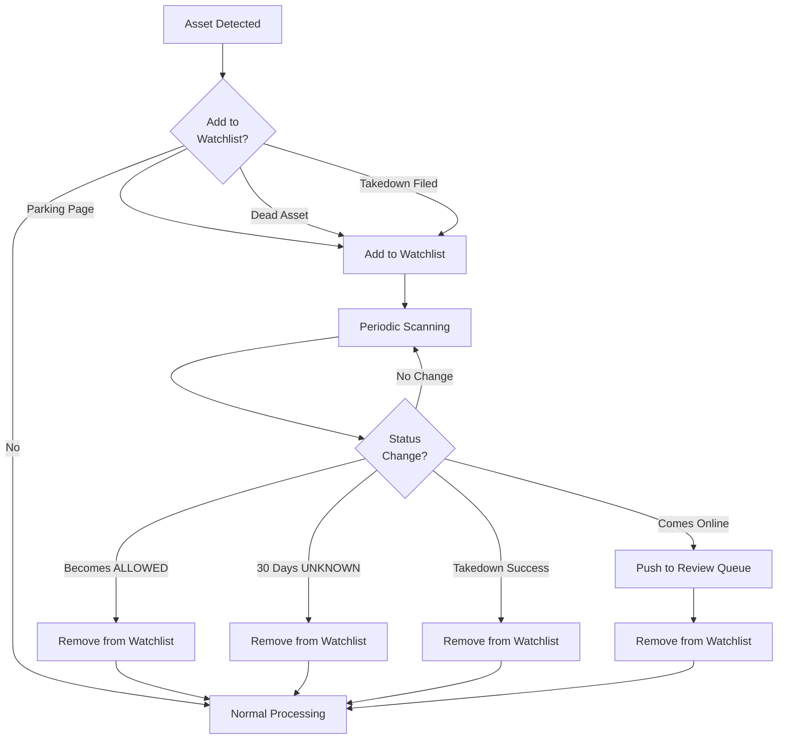

## Overview

The watchlist is a set of assets that are not blocked or allowed, but are **actively monitored**. We watchlist assets for two main reasons:

<CardGroup cols={2}>
  <Card title="Review Process" icon="magnifying-glass">
    Monitoring assets to determine if they become malicious
  </Card>
  
  <Card title="Takedown Process" icon="power-off">
    Monitoring assets to determine if they go offline
  </Card>
</CardGroup>

### When Assets Leave the Watchlist

We remove assets from the watchlist for three reasons:

<CardGroup cols={3}>
  <Card title="Asset Allowed" icon="circle-check">
    Asset status changed to ALLOWED
  </Card>
  
  <Card title="Comes Back Online" icon="arrow-rotate-right">
    Previously dead asset becomes accessible again
  </Card>
  
  <Card title="Offline Too Long" icon="clock">
    Asset has been offline for more than 30 days
  </Card>
</CardGroup>

<Info>
For more details about the watchlist concept, see our [Concepts documentation](/concepts/watchlist).
</Info>

## Placing Assets onto the Watchlist

### Review Process

During the review flow, an analyst can choose to put an asset onto the watchlist. This is typically done for two scenarios:

<Tabs>
  <Tab title="Parking Page" icon="parking">
    **What it is:** The domain is reserved but has no active content
    
    **Why we watchlist:** The URL indicates potential brand impersonation, but there's not enough evidence yet to perform a takedown. We monitor to see if malicious content appears.
    
    **Example:** `metamask-airdrop.com` shows a domain parking page, but the name suggests future malicious use.
  </Tab>
  
  <Tab title="Dead Asset" icon="skull">
    **What it is:** The asset is currently offline or inaccessible
    
    **Why we watchlist:** The URL structure suggests brand impersonation, but we can't analyze content that doesn't exist yet. We monitor to detect when it comes online.
    
    **Example:** `uniswap-claim.xyz` returns a 404 error, but the domain name is suspicious.
  </Tab>
</Tabs>

### Takedown Process

When we file a takedown, we automatically place the asset being taken down onto the watchlist.

<Steps>
  <Step title="Takedown Filed">
    Takedown request submitted to the appropriate provider
  </Step>
  
  <Step title="Asset Watchlisted">
    Asset automatically added to watchlist for monitoring
  </Step>
  
  <Step title="Automated Monitoring">
    Regular scans check if the asset goes offline
  </Step>
  
  <Step title="Automatic Completion">
    If asset goes offline, takedown is marked as complete automatically
  </Step>
</Steps>

<Check>
This automation allows us to confirm successful takedowns without manual verification, speeding up the entire process.
</Check>

### Watchlist Eligibility

Only specific asset types can be placed on the watchlist due to our ability to monitor them consistently in an automated fashion:

<CardGroup cols={3}>
  <Card title="URL" icon="link">
    Web addresses and domains
  </Card>
  
  <Card title="Page" icon="file">
    Specific web pages
  </Card>
  
  <Card title="Email" icon="envelope">
    Email addresses
  </Card>
  
  <Card title="Twitter" icon="x-twitter">
    Twitter/X accounts
  </Card>
  
  <Card title="Telegram" icon="telegram">
    Telegram channels and users
  </Card>
</CardGroup>

<Note>
Asset types not on this list are monitored by our human staff for takedown confirmation instead of automated watchlist monitoring.
</Note>

## What Happens When Assets Are on the Watchlist

When an asset is on the watchlist, we monitor it by running asset scans periodically to determine if there is any change in behavior:

<CardGroup cols={3}>
  <Card title="Status Changes" icon="traffic-light">
    Monitoring HTTP status codes and accessibility
  </Card>
  
  <Card title="Content Changes" icon="file-lines">
    Detecting modifications to page content
  </Card>
  
  <Card title="Infrastructure Changes" icon="server">
    Tracking DNS record and hosting changes
  </Card>
</CardGroup>

We also run checks to determine if we should keep the asset on the watchlist or remove it because it's unlikely to become malicious.

<Tip>
**Adaptive Frequency:** Assets recently added to the watchlist are scanned more frequently. As time passes without changes, scan frequency decreases to optimize resources.
</Tip>

## Scan Frequency

We cycle through the watchlist each minute, checking about **150 assets at a time**. Scan frequency depends on how long the asset has been on the watchlist and its current status.

### UNKNOWN / ALLOWED Assets

Assets that are not yet blocked are scanned more frequently:

| Time on Watchlist | Scan Frequency |
|-------------------|----------------|
| < 6 hours | Hourly |
| < 24 hours | Every 2 hours |
| < 2 days | Every 4 hours |
| < 7 days | Every 6 hours |
| < 2 weeks | Every 12 hours |
| < 1 month | Daily |
| < 2 months | Every 2 days |
| > 2 months | Every 4 days |

### BLOCKED Assets

Blocked assets are scanned less frequently since they're already protected:

| Time on Watchlist | Scan Frequency |
|-------------------|----------------|
| < 6 hours | Every 3 hours |
| < 24 hours | Every 6 hours |
| < 2 days | Every 12 hours |
| < 7 days | Every 18 hours |
| < 2 weeks | Every 36 hours |
| < 1 month | Every 3 days |
| < 2 months | Every 6 days |
| > 2 months | Every 12 days |

<Info>
**Why the difference?** UNKNOWN/ALLOWED assets need closer monitoring to catch when they become malicious. BLOCKED assets are already protected, so we primarily monitor to confirm takedown success.
</Info>

## Removing Assets from the Watchlist

Assets are automatically removed from the watchlist under specific conditions:

### Asset Becomes ALLOWED

<Card title="Status Change to ALLOWED" icon="circle-check">
  If an asset's status changes from `BLOCKED` or `UNKNOWN` to `ALLOWED`, we immediately remove it from the watchlist.
  
  **Reason:** Allowed assets are verified as legitimate and don't require monitoring.
</Card>

### Asset Comes Online

<Card title="Liveness Status Change" icon="signal">
  If an asset's liveness status changes from `DEAD` to `ALIVE` or `UNKNOWN`, we remove it from the watchlist.
  
  **What happens next:** The asset is pushed back into the review queue where a human analyst will evaluate whether it's malicious.
</Card>

### Decay Factor

Assets are removed from the watchlist when they've been there too long without changes:

<AccordionGroup>
  <Accordion title="UNKNOWN Assets - 30 Day Limit" icon="calendar">
    If an asset is in `UNKNOWN` status, we remove it from the watchlist after **30 days**.
    
    **Reason:** If an asset hasn't become malicious after a month, it's unlikely to pose a threat.
  </Accordion>
  
  <Accordion title="Takedown Success" icon="circle-check">
    If the asset was watchlisted during the takedown process and the takedown is in `IN_PROGRESS` state:
    
    - Asset goes offline → Removed from watchlist
    - Takedown provider suspends the asset → Removed from watchlist
    
    **Reason:** The takedown was successful, so continued monitoring is unnecessary.
  </Accordion>
  
  <Accordion title="Manual Removal" icon="user">
    An analyst can manually remove an asset from the watchlist if they determine it's no longer necessary to monitor.
    
    **Reason:** Human judgment may identify cases where automated rules don't apply.
  </Accordion>
</AccordionGroup>

## Watchlist Workflow

## Best Practices

<CardGroup cols={2}>
  <Card title="Use for Suspicious Domains" icon="magnifying-glass">
    Watchlist domains with suspicious names but no active content yet
  </Card>
  
  <Card title="Monitor Takedowns" icon="eye">
    Let the watchlist automatically confirm takedown success
  </Card>
  
  <Card title="Review Regularly" icon="calendar-check">
    Periodically review long-term watchlist items to ensure they're still relevant
  </Card>
  
  <Card title="Trust the Automation" icon="robot">
    The adaptive scan frequency optimizes monitoring without manual intervention
  </Card>
</CardGroup>

---

<Card
  title="View Your Watchlist"
  icon="list"
  href="https://app.chainpatrol.io"
>
  Access your watchlist dashboard to see all monitored assets and their status
</Card>
