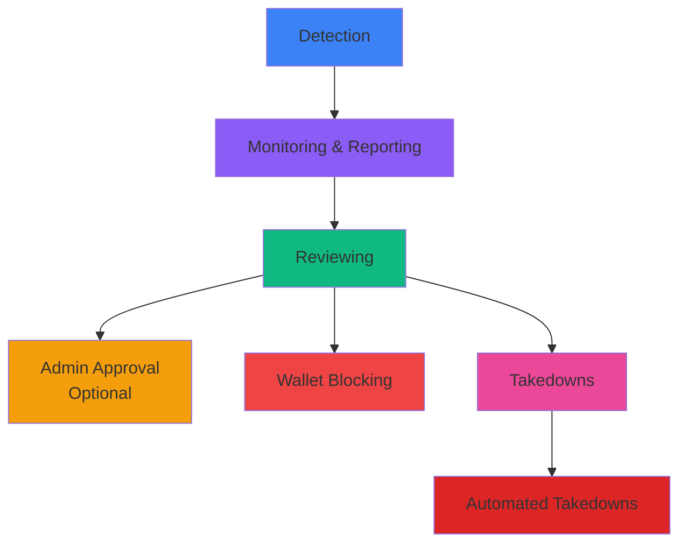

ChainPatrol offers multiple security services that can be configured based on your organization's needs. Each service can be enabled independently and requires specific permissions and approvals before activation.

<Info>
**Where to find Services:** Navigate to your organization settings → Services
</Info>

## Available Services

<CardGroup cols={3}>
  <Card title="Detection" icon="magnifying-glass" color="#3b82f6">
    Automated scanning for threats
  </Card>
  
  <Card title="Monitoring & Reporting" icon="eye" color="#8b5cf6">
    Continuous threat intelligence
  </Card>
  
  <Card title="Reviewing" icon="clipboard-check" color="#10b981">
    Expert threat validation
  </Card>
  
  <Card title="Admin Approval" icon="user-shield" color="#f59e0b">
    Internal approval workflow
  </Card>
  
  <Card title="Wallet Blocking" icon="wallet" color="#ef4444">
    Real-time wallet protection
  </Card>
  
  <Card title="Takedowns" icon="power-off" color="#ec4899">
    Professional threat removal
  </Card>
  
  <Card title="Automated Takedowns" icon="bolt" color="#dc2626">
    Instant takedown submission
  </Card>
</CardGroup>

## Detection

<Tabs>
  <Tab title="What It Does" icon="info">
    The Detection service automatically scans various sources across the internet to identify potentially malicious assets targeting your brand or organization. This includes monitoring domain registrations, social media platforms, and other channels where threats commonly appear.
  </Tab>
  
  <Tab title="Who Needs It" icon="users">
    **Ideal for:**
    - Organizations that want proactive monitoring for brand impersonation
    - Teams looking to identify threats before they reach end users
    - Companies with significant online presence susceptible to phishing attacks
  </Tab>
  
  <Tab title="When to Enable" icon="calendar">
    **Prerequisites:**
    - Complete your organization profile
    - Define your tracked assets (domains, social media handles, brand identifiers)
    - Ensure your team is ready to receive detection alerts
  </Tab>
  
  <Tab title="Requirements" icon="list-check">
    **Required Approvals:**
    - Organization Owner approval (if requested by a member)
    - ChainPatrol staff review for initial setup
    
    **Required Legal Docs:**
    - None
  </Tab>
</Tabs>

---

## Monitoring & Reporting

<Tabs>
  <Tab title="What It Does" icon="info">
    This service continuously monitors the web for new threats to your brand, including phishing sites, scams, and impersonation attempts. When potential threats are detected, they're automatically reported to ChainPatrol's review system for validation and action.
  </Tab>
  
  <Tab title="Who Needs It" icon="users">
    **Ideal for:**
    - Organizations requiring comprehensive brand protection
    - Security teams needing continuous threat intelligence
    - Companies that want to stay ahead of emerging scams and phishing campaigns
  </Tab>
  
  <Tab title="When to Enable" icon="calendar">
    **Prerequisites:**
    - Enable the Detection service first
    - Have dedicated resources to handle threat notifications
    - Establish your organization's threat response workflow
  </Tab>
  
  <Tab title="Requirements" icon="list-check">
    **Required Approvals:**
    - Organization Owner approval (if requested by a member)
    
    **Required Legal Docs:**
    - None
  </Tab>
</Tabs>

---

## Reviewing

<Tabs>
  <Tab title="What It Does" icon="info">
    The Reviewing service ensures that ChainPatrol's security experts manually review all detected threats for your organization. This adds a layer of human validation to confirm threats are genuine and not false positives.
  </Tab>
  
  <Tab title="Who Needs It" icon="users">
    **Ideal for:**
    - Organizations that prioritize accuracy over speed
    - Companies concerned about false positives
    - Teams new to threat detection who want expert validation
  </Tab>
  
  <Tab title="When to Enable" icon="calendar">
    **Prerequisites:**
    - Can be enabled immediately, alongside Detection and Monitoring services
    - Enable when you want ChainPatrol experts to validate all threats before action
  </Tab>
  
  <Tab title="Requirements" icon="list-check">
    **Required Approvals:**
    - Organization Owner approval (if requested by a member)
    
    **Required Legal Docs:**
    - None
  </Tab>
</Tabs>

---

## Obligatory Organization Admin Approval

<Tabs>
  <Tab title="What It Does" icon="info">
    This service requires your organization's administrators to review and approve all threats validated by ChainPatrol staff before they're added to your organization's blocklist. You can configure which types of assets (social media, domains, wallets, etc.) require this approval.
  </Tab>
  
  <Tab title="Who Needs It" icon="users">
    **Ideal for:**
    - Organizations with strict internal compliance requirements
    - Companies that want final oversight on all blocked content
    - Teams with industry-specific regulations requiring manual approval
    - Organizations that prefer to have control over what gets blocked
  </Tab>
  
  <Tab title="When to Enable" icon="calendar">
    **Prerequisites:**
    - Enable after Reviewing service
    - Have designated administrators available to review proposals regularly
    - Enable before Wallet Blocking if you want approval control
  </Tab>
  
  <Tab title="Requirements" icon="list-check">
    **Required Approvals:**
    - None (can be configured directly by organization admins)
    
    **Required Legal Docs:**
    - None
  </Tab>
  
  <Tab title="Configuration" icon="gear">
    **Configuration Options:**
    - Enable/disable the approval requirement
    - Select specific asset types that require approval:
      - Domains
      - Social media accounts
      - Messaging apps
      - Crypto addresses
      - And more
    
    <Note>
    If no specific types are selected, all asset types will require approval
    </Note>
  </Tab>
</Tabs>

---

## Wallet Blocking

<Tabs>
  <Tab title="What It Does" icon="info">
    Approved threats are added to ChainPatrol's global blocklist, which is consumed by major cryptocurrency wallets and platforms, including Coinbase, MetaMask, and others. This prevents users from interacting with malicious addresses, domains, or contracts in real-time.
  </Tab>
  
  <Tab title="Who Needs It" icon="users">
    **Ideal for:**
    - Cryptocurrency projects and protocols
    - DeFi platforms
    - NFT projects
    - Web3 organizations
    - Any company whose users interact with blockchain wallets
  </Tab>
  
  <Tab title="When to Enable" icon="calendar">
    **Prerequisites:**
    <Steps>
      <Step title="Complete Organization Profile">
        Ensure all organization details are accurate
      </Step>
      
      <Step title="Configure Tracked Assets">
        Set up all assets you want to protect
      </Step>
      
      <Step title="Enable Core Services">
        Detection, Monitoring, and Reviewing must be active
      </Step>
      
      <Step title="Verify Configuration">
        Confirm organization assets and tracked asset scans are correct
      </Step>
    </Steps>
  </Tab>
  
  <Tab title="Requirements" icon="list-check">
    **Required Approvals:**
    - Organization Owner approval (required)
    - Acknowledgment that organization assets and tracked assets are correctly configured
    
    **Required Legal Docs:**
    - None
    
    <Warning>
    **Important:** Enabling Wallet Blocking has immediate impact on end-users. Organizations must verify their asset configuration is accurate before enabling this service.
    </Warning>
  </Tab>
</Tabs>

---

## Takedowns

<Tabs>
  <Tab title="What It Does" icon="info">
    For approved threats, ChainPatrol submits professional takedown requests to hosting providers, domain registrars, and platform administrators on your behalf. Our team handles the entire takedown process, including follow-ups and documentation.
  </Tab>
  
  <Tab title="Who Needs It" icon="users">
    **Ideal for:**
    - Organizations that want active threat removal, not just detection
    - Companies lacking in-house expertise for filing takedown requests
    - Teams that need to enforce intellectual property and trademark protection
    - Brands experiencing high volumes of impersonation or phishing
  </Tab>
  
  <Tab title="When to Enable" icon="calendar">
    **Prerequisites:**
    - Enable Detection, Monitoring, and Reviewing services
    - Verify your organization has proper brand protection policies in place
    - Be ready for ChainPatrol to represent your organization in takedown communications
  </Tab>
  
  <Tab title="Requirements" icon="list-check">
    **Required Approvals:**
    - Organization Owner approval (if requested by a member)
    - ChainPatrol legal review
    
    **Required Legal Docs:**
    - Proof of trademark or brand ownership
    - Organization contact information
    - Authorized representative details
  </Tab>
</Tabs>

---

## Automated Takedowns

<Tabs>
  <Tab title="What It Does" icon="info">
    Takedown requests are submitted automatically to hosting providers immediately after a threat is approved by ChainPatrol staff (and your organization, if Obligatory Organization Admin Approval is enabled). This provides the fastest possible response time for threat removal.
  </Tab>
  
  <Tab title="Who Needs It" icon="users">
    **Ideal for:**
    - Organizations experiencing high volumes of threats requiring rapid response
    - Companies with mature threat detection processes
    - Teams that trust ChainPatrol's review process completely
    - Brands in high-risk industries (cryptocurrency, finance, e-commerce)
  </Tab>
  
  <Tab title="When to Enable" icon="calendar">
    **Prerequisites:**
    <Steps>
      <Step title="Enable All Other Services">
        All services must be enabled and functioning properly
      </Step>
      
      <Step title="Upload Power of Attorney">
        Valid POA document must be uploaded
      </Step>
      
      <Step title="Configure Website URL">
        Organization's main website URL must be set
      </Step>
      
      <Step title="Validate Detection">
        Have confidence in the accuracy of your threat detection
      </Step>
    </Steps>
  </Tab>
  
  <Tab title="Requirements" icon="list-check">
    **Required Approvals:**
    - Organization Owner approval (required)
    - ChainPatrol legal team approval
    
    **Required Legal Docs:**
    - **Power of Attorney (POA) document** - Authorizes ChainPatrol to submit takedown requests on your behalf
    - Main website URL for your organization
    - Trademark registration documents
    - Authorized signatory information
    
    <Warning>
    **Important:** Automated Takedowns cannot be enabled without these prerequisites. The service will remain disabled until both the POA document and website URL are provided.
    </Warning>
  </Tab>
</Tabs>

---

## Approval Process

### Service Enable Request Flow

<Steps>
  <Step title="Request Submission">
    **Organization Members and Staff:**
    - Submit a request to enable the service
    - Organization Owners receive an email notification
    - Request appears as "Pending" in the Services page
    - No changes take effect until approved
  </Step>
  
  <Step title="Owner Approval">
    **Organization Owners:**
    - Can enable services immediately without approval
    - Can approve pending requests from team members
    - Receive email notifications for all service change requests
  </Step>
  
  <Step title="ChainPatrol Review">
    **For certain services:**
    - Some services require ChainPatrol staff verification
    - Legal team reviews documentation for Takedowns and Automated Takedowns
    - Security team validates configuration for Wallet Blocking
  </Step>
</Steps>

### Disabling Services

<CardGroup cols={2}>
  <Card title="Owner Actions" icon="user-shield">
    Organization Owners can disable any service at any time
  </Card>
  
  <Card title="Member Requests" icon="users">
    Members with OrganizationServices:update permission can request to disable services
  </Card>
  
  <Card title="Immediate Effect" icon="bolt">
    Disabling services takes effect immediately for the requesting owner
  </Card>
  
  <Card title="Data Preservation" icon="database">
    Service data and history are preserved when disabled
  </Card>
</CardGroup>

---

## Legal Requirements

### Required Documentation by Service

| Service | Documents Required | When Needed |
|---------|-------------------|-------------|
| Detection | None | - |
| Monitoring & Reporting | None | - |
| Reviewing | None | - |
| Obligatory Organization Admin Approval | None | - |
| Wallet Blocking | None (but verification required) | - |
| Takedowns | Trademark proof, Authorized representative details | Before enabling |
| Automated Takedowns | Power of Attorney, Trademark registration, Main website URL | Before enabling |

### Power of Attorney Requirements

For Automated Takedowns, your Power of Attorney document must:

<AccordionGroup>
  <Accordion title="Authorization Scope" icon="scale-balanced">
    Specifically authorize ChainPatrol to submit takedown requests on your organization's behalf
  </Accordion>
  
  <Accordion title="Signature Requirements" icon="signature">
    Be signed by an authorized representative of your organization
  </Accordion>
  
  <Accordion title="Organization Details" icon="building">
    Include your organization's legal name and contact information
  </Accordion>
  
  <Accordion title="Validity Period" icon="calendar">
    Be dated within the last 12 months (recommended)
  </Accordion>
  
  <Accordion title="File Format" icon="file-pdf">
    Be uploaded in PDF format to your organization settings
  </Accordion>
</AccordionGroup>

<Tip>
**How to upload:** Navigate to Organization Settings → Documents → Upload Power of Attorney
</Tip>

### Trademark Documentation

For both Takedowns and Automated Takedowns:

<CardGroup cols={2}>
  <Card title="Registration Numbers" icon="hashtag">
    Provide trademark registration numbers or pending applications
  </Card>
  
  <Card title="Jurisdictions" icon="globe">
    Include jurisdictions where trademarks are registered
  </Card>
  
  <Card title="Ownership Proof" icon="certificate">
    Demonstrate clear ownership of brand assets
  </Card>
  
  <Card title="Commercial Use" icon="store">
    Provide evidence of legitimate use in commerce
  </Card>
</CardGroup>

---

## Service Dependencies

---

<Card
  title="Configure Your Services"
  icon="gear"
  href="https://app.chainpatrol.io"
>
  Log in to your dashboard to enable and configure services for your organization
</Card>
